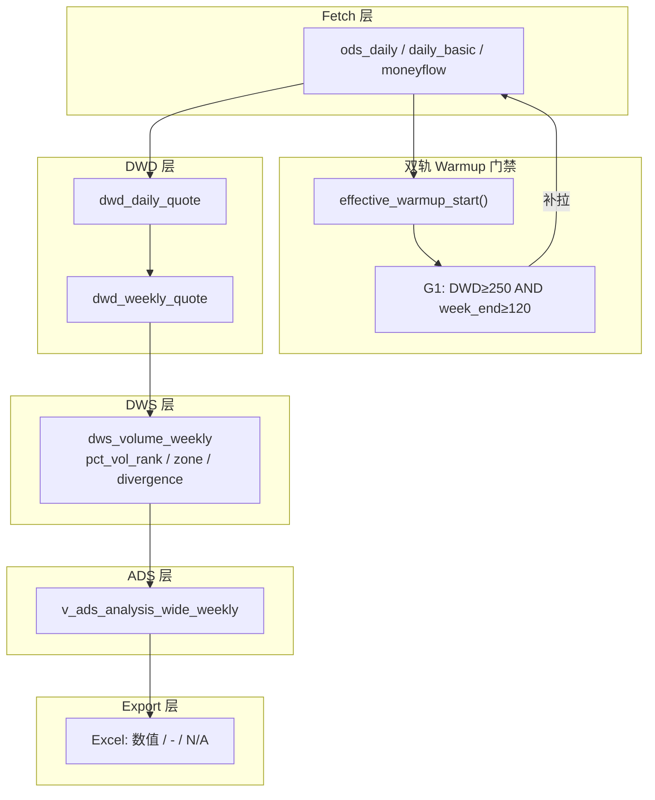

# 导出数据质量修复 — 数据架构设计

**日期：** 2026-06-06  
**状态：** 待审批  
**上游：** 交易专家方案（D1=分层 warmup A，D2=导出三分法 B）  
**关联设计：** `~/.gstack/projects/Tradeanalysis/joesun-perf-b2-polyfit-vectorization-design-20260606-220000.md`

---

## 1. 架构目标

| 目标 | 度量 |
|------|------|
| 恢复周线量能状态指标 | `dws_volume_weekly.pct_vol_rank` 填充率 ≥90%（上市≥120 周） |
| 消除视图映射遗漏 | `sideways` 宽表可见 21/21 |
| 导出语义可治理 | `-` / `N/A` / 数值 三分，用户不再误判 |
| 不破坏日线路径 | 日线 warmup=250、calc 指纹跳过逻辑不变 |

**非目标：** 不修改背离事件判定逻辑；不伪造 PE；不做 partial 周线分位降级（用户已否决方案 C）。

---

## 2. 根因 → 架构债映射

```
┌─────────────────────────────────────────────────────────────┐
│  单一 WARMUP_TDAYS=250（orchestrator 唯一门禁）              │
│       ↓                                                     │
│  ODS/DWD 深度 ≈ 56 week-end bar                             │
│       ↓                                                     │
│  calc_volume weekly: window=120 → pct_vol_rank 永 NaN       │
│       ↓                                                     │
│  zone / vol_divergence 级联 NULL → Excel 周线列全空          │
└─────────────────────────────────────────────────────────────┘

并行债：
  schema CASE 漏 sideways → ADS 宽表 NULL（DWS 有值）
  export _SIGNAL_COLS 一刀切 → 事件/状态/缺失 语义混淆
```

---

## 3. 核心设计：双轨 Warmup 模型

### 3.1 常量分层

| 常量 | 值 | 驱动指标 | 说明 |
|------|-----|---------|------|
| `WARMUP_TDAYS` | 250 | PP250d、日线 volume 120d、MACD 60d 背离 | **保持** |
| `WEEKLY_WARMUP_WEEKS` | 120 | volume weekly pct_rank/zone/divergence | **新增** |
| `EFFECTIVE_WARMUP_TDAYS` | `resolve_warmup_tdays(con, end, 120)` | fetch + G1 门禁 | **运行时精确换算** |

**关键决策：** 不用硬编码 `600 = 120×5`。用 `dim_date` 从 `end_date` 向前数第 120 个 `is_week_end=1` 的交易日，取该日作为 `weekly_warmup_start`。这样自动覆盖春节、长假，与 `build_dim` 周划分一致。

```python
# orchestrator.py 新增
def resolve_weekly_warmup_start(con, end_date: str, n_weeks: int = 120) -> Optional[str]:
    """第 n_weeks 个 week-end 交易日（含 end 所在周）对应的 trade_date。"""
    row = con.execute("""
        SELECT trade_date FROM (
            SELECT trade_date,
                   ROW_NUMBER() OVER (ORDER BY trade_date DESC) AS rn
            FROM dim_date
            WHERE is_trade_day = 1 AND is_week_end = 1 AND trade_date <= ?
        ) WHERE rn = ?
    """, [end_date, n_weeks]).fetchone()
    return row[0] if row else None

def effective_warmup_start(con, ts_code: str, calc_date: str) -> str:
    """max(250tdays_start, weekly_120w_start, list_date)。"""
    daily_start = ...  # 现有 _compute_fetch_range 逻辑
    weekly_start = resolve_weekly_warmup_start(con, calc_date, WEEKLY_WARMUP_WEEKS)
    # clamp list_date, delist_date
    return max(daily_start, weekly_start)
```

### 3.2 门禁接入点（全量清单）

| 接入点 | 文件 | 改动 |
|--------|------|------|
| G1 完整度 | `orchestrator.check_data_completeness` | `min_daily_rows` 默认改为 `EFFECTIVE_WARMUP_TDAYS` 对应的 DWD 行数阈值；或新增 `min_week_end_bars=120` 二次检查 |
| auto-fetch | `run_calc` → `_compute_fetch_range` | `lookback_tdays` 改为动态：`COUNT(trading_days FROM effective_start TO end)` |
| fetch CLI | `cli fetch` 全市场增量 | 传入 active codes 时，per-stock 增量检测仍有效；**首次 backfill** 需全量 `fetch` 触发补历史 |
| calc 跳过 | `VolumeCalculator` weekly | **零逻辑改动**（window=120 保持）；数据够了自然出值 |
| 指纹跳过 | `check_dwd_unchanged` | DWD 扩深后指纹变 → 自动重算，无需特殊处理 |

### 3.3 推荐 G1 增强（双维度检查）

仅 bump `min_daily_rows` 到 ~600 **不够精确**（DWD 行数 ≠ week-end bar 数，因含停牌填充行）。

**建议：** `check_data_completeness` 返回结构扩展：

```python
{
  "ok": [...],
  "missing": {
    "000001.SZ": {
      "dwd_rows": 580,
      "week_end_bars": 55,      # 新增
      "need_dwd_rows": 250,
      "need_week_end_bars": 120,
      "reason": "weekly_warmup", # daily_ok | weekly_warmup | both
    }
  }
}
```

week_end_bars 批量 SQL（一次 GROUP BY）：

```sql
SELECT w.ts_code, COUNT(*)
FROM dwd_weekly_quote w
JOIN dim_date d ON w.trade_date = d.trade_date AND d.is_week_end = 1
WHERE w.ts_code IN (...)
GROUP BY w.ts_code
```

auto-fetch 触发条件：`dwd_rows < 250 OR week_end_bars < 120`（上市不足 120 周除外）。

---

## 4. 数据流（修复后）



---

## 5. ADS / Schema 改动（Batch 0）

### 5.1 sideways 映射 — 4 处 CASE 同步

| 视图 | schema.py 行区 |
|------|---------------|
| `v_ads_analysis_wide_daily` | ~610 |
| `v_ads_analysis_wide_weekly` | ~710 |
| `v_ads_index_wide` | ~792 |
| `v_ads_index_wide_weekly` | ~857 |

```sql
WHEN 'sideways' THEN '均线走平 — 双斜率近零，方向待定'
```

**部署：** `init_schema()` 或实库 `CREATE OR REPLACE VIEW`。无需 DWS 重算。

### 5.2 不新增 ADS 列

导出三分法在 **Python 导出层** 实现，不改宽表 DDL，避免 API/视图消费者行为突变。

---

## 6. Export 层三分法（Batch 2）

### 6.1 列 taxonomy

| 类别 | 常量集 | NULL 展示 | 示例列 |
|------|--------|----------|--------|
| **事件信号** | `_EVENT_SIGNAL_COLS` | `-` | macd_divergence, dde_divergence, vol_divergence, kpattern, turning_point, alert, vol_signal |
| **状态指标** | `_STATE_METRIC_COLS` | 有值→数值；不可算→`N/A` | pct_vol_rank, vol_zone, ma_alignment, macd_zone, macd_trend, price_position_* |
| **基本面** | `_FUNDAMENTAL_COLS` | pe_ttm NULL→`N/A`；其余保持空或 N/A | pe_ttm, turnover_rate |

**从 `_SIGNAL_COLS` 迁出：** `pct_vol_rank`, `vol_zone`, `ma_alignment`, `price_position_*`（现为 signal 误分类）。

### 6.2 不可算判定（导出时）

优先 **DWS 值是否为 NULL**，辅以深度规则（避免依赖 skip_log 滞后）：

| 列 | N/A 条件 |
|----|---------|
| 日线 pct_vol_rank / vol_zone | `v.pct_vol_rank IS NULL` 且 DWD daily 非停牌行 < 120 |
| 周线 pct_vol_rank / vol_zone | `vw.pct_vol_rank IS NULL` 且 week_end_bars < 120 |
| ma_alignment | `a.alignment IS NULL`（含 DWS 未算） |
| pe_ttm | `q.pe_ttm IS NULL` |
| price_position_Nd | 对应 DWS 列 NULL |

实现：导出前一次性批量查 `week_end_bars` 字典（与 calc 共用 SQL），merge 到 DataFrame，在 `_translate_df` 分派。

### 6.3 表头 UX

Row 2 副标题或 sheet 顶部注释（一行）：

> 说明：`-` = 当日无信号；`N/A` = 历史不足或源端无数据；数值 = 有效指标

---

## 7. calc_volume 周线 — 确认无需改公式

| 参数 | daily | weekly | 备注 |
|------|-------|--------|------|
| pct_rank window | 120 | 120 | weekly = 120 **周** |
| zone 迟滞 | 2/5 日 | 2/5 **周** | 同一 `_compute_zone` |
| divergence window | 60 | 60 | weekly = 60 **周** |

**架构师结论：** 公式正确，输入不足。fix data depth，not algorithm。

---

## 8. 运维与迁移

### 8.1 发布顺序

```
1. 代码合并（Batch 0 schema + Batch 1 orchestrator + Batch 2 export + tests）
2. 实库 init_schema（刷新 4 个 VIEW）
3. python -m backend.cli fetch          # 全市场补 120 周历史（耗时最长）
4. rebuild 自动在 fetch 后 / calc 内触发
5. python -m backend.cli calc --date YYYYMMDD
6. python -m scripts.health_check       # 新增周线 volume 填充检查
7. python -m backend.cli export --date YYYYMMDD
8. 对比修复前后 Excel 填充率
```

### 8.2 存储与 API 估算

| 项 | 估算 |
|----|------|
| 每股新增 ODS 行 | ~350 交易日（250→600 区间差） |
| 全市场 5500 股 | ~190 万行 ods_daily 增量 |
| tushare API | date-batched 模式下 ~350 日 × 4 接口，与现有并行 fetch 同量级 |
| 首次 fetch 墙钟 | 数小时（与现全市场 fetch 同阶） |
| DWS 重算 | 指纹变 → 全量 volume_weekly 重算；其他指标按需 |

### 8.3 回滚

- Batch 0：还原 VIEW DDL
- Batch 1：回退 `WARMUP` 常量；ODS 已扩深 **不删**（只增数据，无害）
- Batch 2：还原 `export_wide.py`

---

## 9. 可观测性（health_check 扩展）

在 `scripts/health_check.py` 新增 **Section I**：

```python
# 周线 volume 状态指标填充率（最新 calc_date 的 week_end）
c.info("volume_weekly pct_vol_rank 非空",
       "SELECT COUNT(*) FROM v_dws_volume_weekly_latest v "
       "JOIN dim_date d ON v.trade_date=d.trade_date AND d.is_week_end=1 "
       "WHERE v.pct_vol_rank IS NOT NULL")
c.expect_zero("volume_weekly 老股(week_end≥120) pct_rank 仍全空",
              "... WHERE week_end_count>=120 AND pct_vol_rank IS NULL ...")
```

---

## 10. 测试矩阵

| 测试 | 文件 | 覆盖 |
|------|------|------|
| `resolve_weekly_warmup_start` 精确日期 | `test_orchestrator.py` | dim_date 120 周回溯 |
| `check_data_completeness` 双维度 | `test_orchestrator.py` | week_end_bars < 120 → missing |
| `_compute_fetch_range` 扩 lookback | `test_orchestrator.py` | 覆盖 120 周起点 |
| sideways 宽表可见 | `test_schema.py` | CASE 映射 |
| export 三分法 | `test_export_wide.py` | `-` vs `N/A` vs 数值 |
| volume weekly 集成 | `test_calc_volume.py` | 注入 130 week-end bar → pct_rank 非 NaN |

---

## 11. 文件变更清单

| 文件 | Batch | 改动摘要 |
|------|-------|---------|
| `backend/db/schema.py` | 0 | 4 处 sideways CASE |
| `backend/etl/orchestrator.py` | 1 | 常量 + resolve_weekly_warmup_start + completeness 双维 |
| `backend/export_wide.py` | 2 | 列 taxonomy + N/A 规则 + 表头说明 |
| `scripts/health_check.py` | 1 | Section I 周线 volume 填充 |
| `tests/test_etl/test_orchestrator.py` | 1 | warmup 单测 |
| `tests/test_export_wide.py` | 2 | 三分法单测 |
| `tests/test_schema.py` | 0 | sideways 映射 |
| `CLAUDE.md` | 收尾 | 双轨 warmup + 导出语义 |
| `docs/.../2026-05-31-stock-analysis-data-model.md` | 收尾 | §6.5 weekly 120 周 + 导出约定 |

**不改动：** `calc_volume.py` 公式、`calc_macd/dde` 背离逻辑、DWS DDL。

---

## 12. 风险矩阵

| 风险 | 概率 | 影响 | 缓解 |
|------|------|------|------|
| 首次 fetch 超时/限流 | 中 | 补历史不完整 | 熔断器已有；分批 fetch + 断点续拉 |
| 新股 <120 周仍 N/A | 高 | 预期内 | 导出 N/A + spec 说明 |
| Excel 宏依赖 `-` 语义 | 低 | 旧脚本失效 | 仅事件列仍用 `-`；状态列改 N/A |
| 指纹跳过漏重算 volume_weekly | 低 | 部分股仍空 | fetch 后强制 rebuild_all_dwd |

---

## 13. 审批后下一步

1. 用户回复「可以」→ 按 Batch 0→1→2 实施  
2. 运维窗口执行 fetch + calc  
3. 验收 SQL + health_check + Excel 对比  

---

## GSTACK REVIEW REPORT

| 维度 | 结果 |
|------|------|
| Completeness | PASS — 覆盖 P0/P1/P2、数据流、测试、运维 |
| Consistency | PASS — 与交易专家 D1/A D2/B 一致 |
| Clarity | PASS — 文件清单 + SQL 可执行 |
| Scope | PASS — 未引入 partial 降级或公式改动 |
| Feasibility | PASS — 复用现有 fetch/calc 管道 |

**Quality score: 9/10**
