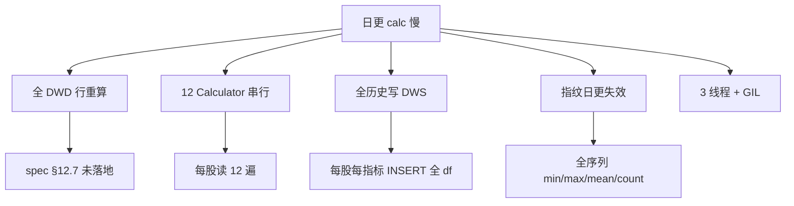

# Calc 阶段增量优化方案（架构师版）

**日期：** 2026-06-07  
**作者视角：** 数据架构师  
**状态：** 待审批  
**上游讨论：** calc 耗时分析、与项目 123 对比、60 日窗口 / warmup / 全历史语义澄清  
**前置已落地：** `2026-06-06-fetch-calc-performance-optimization.md`（A1–A5 + B1 + B2 已完成）

---

## 0. 执行摘要

| 项 | 现状 | 目标 |
|----|------|------|
| 日更 calc 墙钟 | **~2195s（36.6 min）**（2026-06-06 实测，5385 股） | **显著缩短**（不设硬 KPI，见 D4） |
| 对比项目 123 `parallel_pool` | **~585s（9.8 min）**（5525 股，8 进程） | 同量级（允许更重指标集） |
| spec §12.7 增量策略 | **未实现**（仍全 DWD 行重算 × 12 pass） | 落地窗口增量 + 窄写 |
| 重复跑同一天 | 指纹跳过有效（秒级） | 保持 |

**核心判断：** 慢的主因不是 DuckDB vs SQLite，而是 **计算模型**（全历史 × 12 轮 × 全量写）与 **spec 设计**（60 日增量）之间的实现缺口。本方案补齐该缺口，不改动指标业务口径。

---

## 1. 问题陈述（有据）

### 1.1 实测耗时

**Tradeanalysis**（`run --date 20260605`，2026-06-06）：

```
calc 5385 stocks with 3 threads
calc ALL DONE — 2195s
```

**项目 123**（`logs/batch_trend_analyzer_20260605.log`）：

```
[PERF] analyze_batch stage=parallel_pool elapsed_sec=584.84 processes=8
分析周期: 20241014 至 20260605（400 交易日）
```

### 1.2 实库 DWD 规模（2026-06-07 查询）

```
dwd_daily_quote: 3,043,078 行, 5524 股, 20150105~20260605
000001.SZ: 578 行（该股 DWD 全量，非 123 的 400 日截断）
```

### 1.3 已完成优化（2026-06-06）为何仍慢

| 已落地项 | 解决的瓶颈 | 日更场景剩余瓶颈 |
|----------|-----------|-----------------|
| B1 批量取数 | N+1 SELECT | 仍读 **全 DWD 行** |
| B2 polyfit 向量化 | 趋势斜率热循环 | **背离/拐点** 仍 O(n×60) |
| A4 指纹批量 | N+1 指纹查询 | **全序列指纹** 日更失效 |
| 3 线程 calc | 单线程 58min | 仍 **12 pass 串行** + GIL |

---

## 2. 概念澄清（讨论沉淀）

### 2.1 warmup ≠ calc 范围

| 概念 | 代码常量 | 含义 | 当前行为 |
|------|---------|------|----------|
| **warmup 门禁** | `WARMUP_TDAYS = 250` | DWD 行数 ≥250 才允许 calc | ✅ 仅门禁（`orchestrator.py:202`） |
| **calc 范围** | （无常量，隐式全量） | 每次实际计算多少 bar | ❌ `load_quote_groups` **无日期过滤**，拉 DWD 全部行 |

**结论：** warmup=250 不要求每次重算 250 天；当前问题是 **对 DWD 全部 bar 全算全写**。

### 2.2 「全历史」vs 123「400 交易日」

| | 项目 123 | Tradeanalysis |
|--|---------|---------------|
| 读数 SQL | `trade_date >= start AND <= end`（400 日窗） | `WHERE ts_code IN (...)` **无日期上限** |
| 配置 | `required_trading_days: 400` | DWD 存 2015~今（设计意图，实库约 578 行/股） |
| 输出 | 每股 **1 行** 分析报告 | 每股 **每 bar 1 行** × 12 DWS 表 |
| 产品契约 | 选股批处理 | 指标数据仓库 + `/history` API |

**「全历史」定义：** calc 阶段读取并计算该股在 `dwd_*` 中 **从 MIN(trade_date) 到 MAX(trade_date) 的每一根 bar**，而非 123 式硬截 400 日。

### 2.3 spec「60 日滑动窗口」的真实含义

| 出处 | 内容 |
|------|------|
| spec §12.1 #7 | DWS 增量 **60 日滑动窗口重算**，EMA 误差 **<0.01%** |
| spec §12.7 | 最近 60 交易日产生新 calc_date 快照；更早行冻结 |
| spec 索引注释 | 增量计算按 ts_code 拉最近 **60 日** |

**设计意图（EMA/背离类）：**

- 日更只新增 1 bar；EMA/MACD/DEA 可递推，60 根足以收敛（需 golden-master 验证）
- MACD/DDE/Volume 背离窗口 = **60 bar**（`calc_macd.py:121`, `calc_dde.py:366`, `calc_volume.py:81`）

**诚实修正：60 日不能覆盖全部指标**

全项目硬编码窗口清单：

| 模块 | 硬编码窗口 | 源文件 |
|------|-----------|--------|
| PricePosition | **60 / 120 / 250** | `calc_price_position.py:25` |
| Volume 分位 | **120** | `calc_volume.py:69` |
| Volume 趋势 | **10** | `calc_volume.py:78` |
| MACD 背离 | **60** | `calc_macd.py:121` |
| MACD 趋势 | **5**（decay=0.15） | `calc_macd.py:65` |
| MACD 最小行数 | **27** | `calc_macd.py:37` |
| MA | MA**5/10**，斜率 **5**，alignment 近 **10** 日交叉 | `calc_ma.py` |
| KPattern | **60** 日高点、**20** 日涨幅 | `calc_kpattern.py:107-117` |
| DDE 背离 | **60** | `calc_dde.py:366` |
| DDE 趋势 | **8**（decay=0.20） | `calc_dde.py:304` |
| DDE 最小行数 | **10** | `calc_dde.py:57` |
| warmup 门禁 | **250** 交易日 | `orchestrator.py:202` |
| 周线 warmup | **120** 周 | `orchestrator.py:203` |

**重算宽度：不采用固定常数，改由注册表动态推导（见 §5.0）。**

> spec「60 日」是 EMA 收敛**验证下界**（golden-master 验证误差 <0.01%），不是全局硬编码。
> 实现层 `recalc_bars = max(各指标 RecalcSpec.total)`，新增指标时只改该 Calculator 的声明。

### 2.4 PricePosition 增量可行性（讨论确认）

公式：`price_position_N = (close - roll_min_N) / (roll_max_N - roll_min_N) × 100`

日更时，新 bar 的 N 日窗口 = 旧窗口滑出最老 1 根、滑入新 1 根。  
**若**（a）滑出 bar 不是旧 min/max，且（b）新 close 在旧 [min,max] 内 → min/max 不变，只更新分子。  
可采用 **滑动窗口极值 deque** 增量维护，日更通常只算 **1 根新 bar**（历史 bar 的 PP 值不变）。

---

## 3. 根因归纳



| # | 根因 | 证据 | 优先级 |
|---|------|------|:------:|
| R1 | spec 增量策略未实现 | §12.7 vs `load_quote_groups` 无日期截断 | P0 |
| R2 | 12 pass 重复读/算 | `_calc_stock_chunk` 串行 6×2 Calculator | P1 |
| R3 | 全量写 DWS（非窄写） | `insert_dws_batch` 写整股 df | P0 |
| R4 | 指纹粒度错误 | `compute_fingerprint` 全序列统计 | **P0.5（已决）** |
| R5 | 并行度不足 | 3 线程 vs 123 的 8 进程 | P2 |
| R6 | 背离等热循环未向量化 | `_compute_divergence` for 循环 | P3 |

---

## 4. 目标与非目标

### 4.1 目标

1. 日更 calc **显著缩短**（不设墙钟硬 KPI；以 golden-master 正确性为准，耗时作观测指标）
2. **落地 spec §12.7** 增量快照语义（冻结窗口外历史，窗口内新 calc_date）
3. **保持** API `/history`、export、`v_*_latest` 语义不变
4. **保持** 指标口径不变（golden-master 逐行等价，容差 1e-9）
5. 重复跑同一天仍 **秒级跳过**

### 4.2 非目标

1. **不**改成 123 式「400 日截断 + 每股 1 行」（产品契约不同）
2. **不**把指标计算下推到 DuckDB SQL（Python 事件检测逻辑保留）
3. **不**在本方案内改 MACD 参数 (12,26,9) 或新增指标
4. **不**替换 DuckDB 为 SQLite

---

## 5. 目标架构

### 5.0 动态重算窗口注册表（RecalcSpec Registry）★ 替代固定 270

**问题：** 固定 `270` / `300` 在新增指标（如 500 日窗口）时必埋雷，与 `WARMUP_TDAYS=250` 硬编码同理。

**方案：** 每个 Calculator 声明 `RecalcSpec`（单源真相），编排器**运行时聚合**。

```python
# backend/etl/recalc_spec.py（新文件）
@dataclass(frozen=True)
class RecalcSpec:
    lookback: int      # 最大统计/滚动窗口（bar 数）
    seed: int = 0      # 递推种子期（EMA/SMA 最长周期）
    event_tail: int = 0  # 事件传播尾（背离去重 5、alignment 交叉史 10 等）
    min_rows: int = 0  # 该股最小可算行数（准入，非重算宽度）

    @property
    def total(self) -> int:
        return self.lookback + self.seed + self.event_tail

def resolve_recalc_bars(specs: list[RecalcSpec], safety: int = 5) -> int:
    return max((s.total for s in specs), default=0) + safety
```

**各 Calculator 当前硬编码 → RecalcSpec 映射（审计清单）：**

| Calculator | freq | lookback | seed | event_tail | min_rows | **total** | 证据 |
|------------|------|:--------:|:----:|:----------:|:--------:|:---------:|------|
| MACDCalculator | daily | 60 | 26 | 5 | 27 | **91** | `w=59`, EMA26, dedup 5 |
| MACDCalculator | weekly | 60 | 26 | 5 | 27 | **91** | 同上 |
| MACalculator | daily | 10 | 10 | 5 | 11 | **25** | MA10, slope 5, cross 10 |
| MACalculator | weekly | 10 | 10 | 5 | 11 | **25** | 同上 |
| KPatternCalculator | daily | 60 | 10 | 5 | 30 | **75** | 60d high, MA10, `min_data_rows` |
| KPatternCalculator | weekly | 60 | 10 | 5 | 30 | **75** | 同上 |
| DDECalculator | daily | 60 | 5 | 5 | 10 | **70** | 背离 60, DDX2 EMA5, dedup 5 |
| DDECalculator | weekly | 60 | 5 | 5 | 10 | **70** | 同上 |
| VolumeCalculator | daily | 120 | 5 | 5 | 5 | **130** | pct_rank 120, MA5_vol |
| VolumeCalculator | weekly | 120 | 5 | 5 | 5 | **130** | 周线分位同 120 |
| PricePositionCalculator | daily | 250 | 0 | 0 | 2 | **250** | `WINDOWS=[60,120,250]` |
| PricePositionCalculator | weekly | 250 | 0 | 0 | 2 | **250** | 同上 |

**当前聚合结果（`safety=5`）：**

```
resolve_recalc_bars(daily_specs)  = max(91,25,75,70,130,250) + 5 = 255 交易日
resolve_recalc_bars(weekly_specs) = max(91,25,75,70,130,250) + 5 = 255 真周末
```

> 与此前手写 270 **接近但非硬编码**；新增 500 日指标 → 在其 Calculator 写 `lookback=500` → 全局自动变为 505+safety，无需改 orchestrator。

**三层常量统一推导：**

| 常量 | 现硬编码 | 目标推导 |
|------|---------|----------|
| `WARMUP_TDAYS` | 250 | `max(s.min_rows for daily specs)` 或 `max(s.lookback)` — 取 **max(min_rows, lookback)** 中较大者，保证准入与重算一致 |
| `WEEKLY_WARMUP_WEEKS` | 120 | `max(s.lookback for weekly specs)` 在 week-end 维度的等价（Volume 120 周） |
| 日更 `recalc_start` | （无） | `dim_date` 从 `calc_date` 回溯 `resolve_recalc_bars(daily_specs)` 个交易日 |
| 指纹窗口 | （全序列） | 与该股**该 freq 的 RecalcSpec.total** 对齐（P0.5 策略 A） |

**新增指标流程（维护契约）：**

1. 新建 `calc_xxx.py`，实现 `RECALC_SPEC_DAILY` / `RECALC_SPEC_WEEKLY` 类属性
2. 加入 `orchestrator.CALCULATORS`
3. 跑 `tests/test_etl/test_recalc_spec.py` — 断言注册表聚合值、warmup 自动更新
4. **禁止**在 orchestrator 再写死 magic number

**可选：启动时自检**

```python
def audit_recalc_registry():
    """启动/测试时打印各指标 total 与全局 max；lookback 变更时 diff 告警。"""
```

### 5.1 三层语义分离

```
┌─────────────────────────────────────────────────────────┐
│ Layer 1: 数据门禁（warmup）                              │
│   dwd_rows ≥ resolve_warmup_tdays()  ← 注册表推导       │
│   职责：确保 DWD 有足够历史做指标                        │
└─────────────────────────────────────────────────────────┘
                          ↓
┌─────────────────────────────────────────────────────────┐
│ Layer 2: 日更重算窗口（recalc window）                   │
│   daily: calc_date 往前 resolve_recalc_bars(daily) 日   │
│   weekly: calc_date 往前 resolve_recalc_bars(weekly) 周 │
│   职责：限制读/算/写的 bar 范围（随指标集自动伸缩）      │
└─────────────────────────────────────────────────────────┘
                          ↓
┌─────────────────────────────────────────────────────────┐
│ Layer 3: 增量计算策略（per-indicator）                   │
│   EMA 类：种子递推 + 窗口内重算                          │
│   滚动极值类（PP）：deque 增量 / 仅新 bar                │
│   事件类（背离）：窗口内 O(n×60)，仅窗口 bar             │
│   职责：窗口内算法正确 + 最小工作量                      │
└─────────────────────────────────────────────────────────┘
```

### 5.2 日更数据流（目标态）

```
run_calc(calc_date)
  → resolve_recalc_start(con, calc_date, freq)  # 注册表聚合 → dim_date 回溯
  → load_quote_groups(..., start_date=recalc_start)   # 窄读
  → 每股单管线 calc_stock_indicators()                # 12 指标一次算完（P1）
  → 窄写：仅 INSERT [recalc_start, calc_date] 的 bar   # 新 calc_date
  → v_*_latest / export / API 不变
```

### 5.3 与项目 123 的对齐与保留差异

| 借鉴 123 | 保留 Tradeanalysis 差异 |
|----------|------------------------|
| 模块级指纹跳过（`trend_metrics_skip_unchanged_modules`） | 全历史 DWS bar 存储 |
| multiprocessing 进程池 | 12 类指标 + calc_date 快照 |
| 单管线 per-stock（`analyze_stock`） | `/history` 序列查询 |
| 窄读（日期窗） | warmup=250 门禁（123 用 400 日窗） |

---

## 6. 分阶段实施

### Phase P0.5：智能指纹（保守策略 A，已审批）★ 优先于 P0 落地

**背景：** 当前 `compute_fingerprint` 用全序列 `min/max/mean/count`，日更必变 → 跳过失效（DDE 0 skip）。仅做 P0 窄写无法解决「重复跑同日 / DWD 未变仍全算」问题。

**已审批策略 A（保守）：** 同时满足以下两项才跳过该股该指标：

1. `last_trade_date` 与上次 calc 存储值 **相同**（DWD 尾部未伸长）
2. 重算窗口子集 `DWD[recalc_start:calc_date]` 的域指纹 **相同**（覆盖复权修订、尾 bar OHLC 变化）

**指纹结构（替代全序列统计）：**

```python
# 伪代码 — 实现于 base.compute_input_fingerprint(df, recalc_start)
fp = sha256(
    f"last_td:{df.trade_date.max()}|"
    f"window:{compute_fingerprint(df[df.trade_date >= recalc_start])}"
)[:16]
```

**域划分（与 Calculator 输入对齐）：**

| 域 | 来源表 | 适用 Calculator |
|----|--------|----------------|
| quote | `dwd_daily_quote` / `dwd_weekly_quote` | MACD, MA, KPattern, Volume, PricePosition |
| moneyflow | `dwd_daily_moneyflow` + quote join | DDE |

DDE 单独用 moneyflow 域指纹；其余用 quote 域。日更仅 quote 尾变、moneyflow 未变时，DDE 可独立跳过。

**范围：**

1. 新增 `compute_input_fingerprint(df, recalc_start=None)` + 改造 `check_dwd_unchanged`
2. 6 个 Calculator 传入 `recalc_start`（P0 前可先传 `None` = 全 df，与 P0 并行）
3. 存储指纹仍写 `input_fingerprint` 列（DDL 不变）；语义变更需更新 `test_fingerprint_skip.py`
4. **不**采用激进策略 B（仅 `last_trade_date` 相同即跳过）——复权修订会漏算

**验收：**

- 同 `calc_date` 连续跑两次：**第二次 ≤30s**（全市场）
- DWD 未变、仅重复 calc：skip 率 **≈100%**
- DWD 日增 1 bar：quote 域变 → 依赖 quote 的指标重算；moneyflow 未变 → DDE 可 skip
- adj_factor 修订导致窗口内 close 变：窗口指纹变 → **不跳过**（保守正确）

**风险：** 低（不改指标公式，只改跳过判定）

**工时：** 1d（可与 P0 并行开发，建议 **先于或与 P0 同批上线**）

---

### Phase P0：窗口增量 + 窄写（最高收益，必须先做）

**范围：**

1. `base.load_quote_groups` / DDE batch load 增加 `start_date: Optional[str]`
2. 新增 `backend/etl/recalc_spec.py` + 各 Calculator 声明 `RECALC_SPEC_{DAILY,WEEKLY}`
3. `orchestrator.resolve_recalc_start(con, calc_date, freq)` — 注册表聚合后 `dim_date` 回溯
4. 各 Calculator `calculate()` 接收 `recalc_start`；`_compute_*` 仍对窗口内 df 全算（行为等价于全量截断）
5. `insert_dws_batch` 增加 `trade_date` 范围过滤，只写窗口内行
6. `WARMUP_TDAYS` / `WEEKLY_WARMUP_WEEKS` 改为注册表推导（删除 magic number）
7. 故障恢复：断层天数 > `resolve_recalc_bars(daily)` → 全量重算该股（spec §12.7b 泛化）

**验收：**

- golden-master：窗口截断全量 vs 原全量，窗口内 bar **逐字段相等**（ atol=1e-9）
- golden-master 绿；墙钟记入 `ods_etl_log` 作前后对比（非阻断）

**风险：** 低-中（截断边界需与指标最大窗口对齐）

---

### Phase P1：单管线（指纹已在 P0.5 完成）

**范围：**

1. 新增 `calc_stock_pipeline(con, ts_code, calc_date, recalc_start)` — 一次加载，顺序调用 6×2 指标逻辑（函数抽取，口径不变）
2. 消灭 12 pass 重复 `load_quote_groups`（P0.5 域指纹已覆盖跳过逻辑）

**验收：**

- 与 P0 输出逐行一致
- 与 P0 输出一致；墙钟对比 P0 有下降即可（非硬 KPI）

---

### Phase P2：并行模型升级

**范围：**

1. `ThreadPoolExecutor(3)` → `multiprocessing.Pool(processes=N)`（**D6 已批：A+C**）
   - 默认 `N = min(cpu_count - 1, 8)`
   - 环境变量 `CALC_WORKERS` 正整数可覆盖（与 123 的 `BATCH_PARALLEL_PROCESSES` 对齐思路）
   - 实现 `resolve_calc_workers()` 于 `orchestrator.py` 或 `recalc_spec.py`
2. 子进程独立 `duckdb.connect(DUCKDB_PATH)`（已有 `_calc_stock_chunk` 模式，扩展为进程池）
3. 写冲突：保持每进程写独立股集合，WAL 压测

**验收：**

- 3 线程 vs N 进程 A/B 日志存档（`ods_etl_log`）

---

### Phase P3：算法级增量（首期，D5 已批）

**范围：**

1. **PricePosition**：滑动窗口 min/max deque，日更仅算新 bar
2. **EMA 链**（MACD/DDE）：从 DWS 上一 calc_date 读种子，窗口内递推
3. **背离循环**：窗口内 bar 向量化或 Numba（独立 golden-master）

**验收：**

- 与 P2 输出一致
- 与 P2 输出一致；墙钟为观测项（非硬 KPI）

---

## 7. 各指标日更策略明细

| 指标 | min_rows | RecalcSpec.total | 种子/增量策略 | 写回范围 |
|------|:--------:|:----------------:|--------------|----------|
| MACD daily | 27 | **91** | EMA 种子从 DWS 或窗口前 26 bar | 窗口内 |
| MACD weekly | 27 | **91** | 同上 | 窗口内 |
| MA daily | 11 | **25** | SMA/斜率窗口内重算 | 窗口内 |
| KPattern daily | 30 | **75** | 窗口内全算 | 窗口内 |
| DDE daily | 10 | **70** | DDX2 EMA5 种子 | 窗口内 |
| Volume daily | 5 | **130** | 窗口内全算 | 窗口内 |
| PricePosition | 2 | **250** | P3：deque 增量；P0：窗口 rolling | 窗口内 |
| **全局 daily** | max(min) | **255**（250+5 safety） | `resolve_recalc_bars` 聚合 | — |
| **全局 weekly** | — | **255** 周 | 同上（week-end bar） | — |

> 上表数值随 Calculator 声明自动更新；**禁止**在 orchestrator 维护平行常量。

**日更只新增 1 bar 时的理论工作量：**

| 阶段 | 每股计算 bar 数（日） | vs 当前（~578 全量） |
|------|----------------------|---------------------|
| 当前 | ~578 × 12 pass | 基准 |
| P0.5 | 同左，但 DWD 未变时 **0 pass** | 重复跑批 ~100% skip |
| P0 | ~255 × 12 pass（注册表当前值） | ~44% |
| P1 | ~270 × 1 pass | ~4.7% |
| P3（PP 等） | ~1~270 混合 | ~0.2%~47% |

---

## 8. 受影响文件（全量审计）

| 文件 | Phase | 变更 |
|------|-------|------|
| `backend/etl/recalc_spec.py` | P0 | **RecalcSpec 注册表 + resolve_recalc_bars** |
| `backend/etl/orchestrator.py` | P0–P2 | recalc 窗口、warmup 推导、进程池、管线入口 |
| `backend/etl/base.py` | P0.5–P1 | **P0.5 域指纹**、`load_quote_groups(start_date)`、窄写 |
| `tests/test_etl/test_fingerprint_skip.py` | P0.5 | 保守策略 A 用例 |
| `backend/etl/calc_macd.py` | P0–P1 | 窗口入参、种子（P3） |
| `backend/etl/calc_ma.py` | P0–P1 | 同上 |
| `backend/etl/calc_kpattern.py` | P0–P1 | 同上 |
| `backend/etl/calc_dde.py` | P0–P1 | batch load 加 start_date |
| `backend/etl/calc_volume.py` | P0–P1 | 同上 |
| `backend/etl/calc_price_position.py` | P0–P3 | rolling → deque（P3） |
| `tests/test_etl/test_*` | 全阶段 | golden-master、窗口边界 |
| `tests/test_etl/test_recalc_spec.py` | P0 | 注册表聚合、新增指标回归、warmup 联动 |
| `tests/test_etl/test_orchestrator.py` | P0 | `resolve_recalc_start` 单测 |
| `CLAUDE.md` | 收尾 | calc 增量语义、CALC_WORKERS |
| `docs/superpowers/specs/2026-05-31-stock-analysis-data-model.md` | 收尾 | §12.7 补充 270 日实现口径 |

**不需改动（本方案内）：**

- `backend/db/schema.py`（DDL 不变）
- `backend/export_wide.py`（仍读 `v_*_latest`）
- `backend/api/router.py`（仍读 `v_*_latest`）
- `CALCULATORS` 列表成员（仅编排方式变）

---

## 9. 测试策略

### 9.1 Golden-master（强制）

1. 冻结 10 只股票 × 全 DWD 历史 → 当前全量 calc 输出为 oracle
2. P0.5 后：同 calc_date 连跑两次，第二次 skip 率 ≈100%；日增 1 bar 仅变域重算
3. P0 后：窗口增量输出 vs oracle，**窗口内**逐字段 `atol=1e-9`
4. P1 后：单管线 vs 12 pass，全字段相等
5. EMA 种子递推（P3）：与全量误差 **<0.01%**（spec §12.1 #7）

### 9.2 集成

```bash
pytest tests/test_etl/ -v -k "incremental or fingerprint or golden"
python -m backend.cli calc --date 20260605   # 记录墙钟至 ods_etl_log（对比用，非硬 KPI）
python -m backend.cli calc --date 20260605   # 第二次 < 30s
python -m scripts.health_check               # Section I 仍绿
```

### 9.3 回归场景

| 场景 | 预期 |
|------|------|
| 日更 1 日 | 窄窗口 calc，export 行数不变 |
| 重复 calc 同日 | 域指纹跳过，秒级 |
| 断层 2–60 日 | spec §12.7b 窗口重算 |
| 断层 >60 日 | 该股全量重算 |
| 新股 <250 行 | warmup 门禁仍跳过 |
| 停牌/复牌 | `is_suspended` 过滤不变 |

---

## 10. 风险与回滚

| 风险 | 缓解 |
|------|------|
| 窗口截断导致 EMA 偏差 | golden-master + spec 0.01% 阈值；种子从 DWS 读取 |
| 多进程 DuckDB 写冲突 | 按股分片互斥；压测后调 `CALC_WORKERS` |
| 窄写后 history API 缺旧 calc_date | 旧 calc_date 行保留（INSERT-only），latest 视图不变 |
| P1 单管线引入依赖顺序 bug | 保持现有 Calculator 调用顺序；逐指标 golden |

**回滚：** 每项 Phase 独立 feature flag（`CALC_INCREMENTAL=0` 回退全量模式）。

---

## 11. 实施顺序与工时估算

| 顺序 | Phase | 预估 | 依赖 |
|:--:|-------|------|------|
| 1 | **P0.5 智能指纹（策略 A）** | 1d | 无 |
| 2 | P0 窗口增量 + 窄写 | 2–3d | 无（可与 P0.5 并行） |
| 3 | P1 单管线 | 2d | P0 + P0.5 绿 |
| 4 | P2 多进程 | 1d | P1 绿 |
| 5 | **P3 算法增量（首期）** | 2–3d | P2 绿 |

**首期落地顺序（已批）：** **P0.5** ∥ P0 → P1 → P2 → **P3**（一气呵成，约 8–10d）

---

## 12. 成功标准

| 指标 | 当前 | 目标 |
|------|------|------|
| 日更 calc 墙钟 | 2195s | **缩短**（记录 benchmark，**不设硬 KPI**，D4） |
| 重复 calc 同日 | 未测（指纹部分生效） | **≤30s**（**P0.5 后**，功能性验收） |
| 每股日更计算 pass 数 | 12 | **1**（P1 后） |
| 每股日更读 bar 数 | ~578（全 DWD） | **≤resolve_recalc_bars()**（当前 255，P0 后） |
| pytest | 绿 | 绿 + 新增 golden |
| health_check | 绿 | 绿 |

---

## 13. 决策记录

| # | 议题 | 决定 | 状态 |
|---|------|------|------|
| D1 | **指纹跳过策略** | **A 保守**：`last_trade_date` 相同 **且** 重算窗口子集指纹相同 → 才跳过 | ✅ 2026-06-07 已批 |
| D2 | 指纹修复阶段 | 提前至 **P0.5**（不等 P1） | ✅ 2026-06-07 已批 |
| D3 | 日更重算宽度 | **RecalcSpec 注册表动态聚合**（非固定 270）；`safety=5` 可配置 | ✅ 2026-06-07 已批 |
| D4 | 目标耗时 | **不设硬 KPI**；正确性以 golden-master 为准，墙钟记入 `ods_etl_log` 作观测 | ✅ 2026-06-07 已批 |
| D5 | P3 是否纳入首期 | **纳入首期**：P0.5→P0→P1→P2→**P3** 一并交付 | ✅ 2026-06-07 已批 |
| D6 | calc 并行进程数 | **A+C**：默认 `min(cpu-1, 8)` + `CALC_WORKERS` 可覆盖 | ✅ 2026-06-07 已批 |

### 13.1 D5 说明：P3 是否纳入首期？

**P3 是什么（算法级微增量，在 P0–P2 之后）：**

| 子项 | 做什么 | 不做的后果（仅慢，不错） |
|------|--------|------------------------|
| PP deque | PricePosition 日更只算 **1 根新 bar** 的 min/max | P0 仍对 255 bar 做 rolling |
| EMA 种子 | MACD/DDE 从上一 calc_date 读 EMA 状态再递推 | P0 在 255 bar 窗口内从头算 EMA |
| 背离向量化 | 60 日背离 for 循环改 Numba/向量化 | P0–P2 仍 O(n×60)，但只在 255 bar 内 |

**需要你选的：**

- **纳入首期**：P0.5 → P0 → P1 → P2 → **P3** 一口气做完；工期 +2~3d，追求极致耗时
- ~~不纳入首期~~：**已选纳入首期**（2026-06-07）

### 13.2 D6 说明：calc 并行进程数

**现状：** `ThreadPoolExecutor(max_workers=3)` — 3 **线程**，共享 GIL，写 DuckDB WAL 有锁竞争。

**P2 提议：** 改为 `multiprocessing.Pool` — **进程**并行，绕过 GIL。项目 123 实测 **8 进程 ~585s**。

**需要你选的默认值：**

| 选项 | 含义 | 适用 |
|------|------|------|
| **A. `min(cpu_count-1, 8)`**（方案默认） | 与 123 对齐，M1 8 核 → 7~8 进程 | 内存 ≥16GB |
| **B. `min(cpu_count-1, 4)`** | 保守，减内存与 DuckDB 写冲突 | 内存紧张或先小步验证 |
| **C. 环境变量 `CALC_WORKERS`** | 代码默认 A，运维可覆盖 | 灵活，推荐配合 A |

**已批：A+C**（2026-06-07）。进程数只影响墙钟观测值；压测后可 `CALC_WORKERS=4` 等调低。

---

## 14. 审批门

- [x] 架构方案审批（本文档，D1–D6 全部已批 2026-06-07）
- [ ] 实施计划审批（[`2026-06-07-calc-incremental-optimization-impl.md`](2026-06-07-calc-incremental-optimization-impl.md)）
- [ ] P0 代码 + golden-master 审批
- [ ] 全量上线前墙钟 benchmark 审批

**审批通过后** 进入 `writing-plans` 写 task 级实施计划，再按 engineering-protocol 逐步落地。
