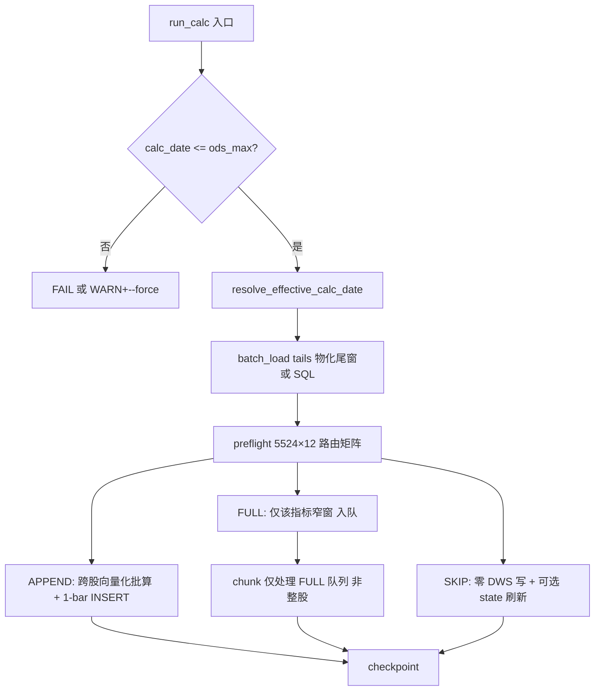

# Calc 根本性性能架构（Quality Gate + 指标图执行 + 向量化 + 零写 SKIP）Implementation Plan

> **For agentic workers:** REQUIRED SUB-SKILL: Use superpowers:subagent-driven-development (recommended) or superpowers:executing-plans to implement this plan task-by-task. Steps use checkbox (`- [ ]`) syntax for tracking.

**Goal:** 在 **零指标语义变更、强签名门禁不变** 前提下，将 **真新日 calc 本体** 从实库 ~48–72 min 压到 **≤5 min（stretch ≤3 min）**，同日复跑 **≤60s**，端到端 `fetch+calc` **≤10 min**（fetch 单独立项）。

**Architecture:** 当前性能瓶颈不是 CPU 公式，而是 **(1) 错误 calc_date 触发全量假跑**、**(2) 每股/每指标固定 I/O**、**(3) SKIP 仍可能写窄窗快照**、**(4) 2549 股 FULL chunk 占 ~48 min**（Run B 实库）。本方案分四支柱：**P0 数据质量门禁** → **P1 指标级执行图（打破 any-FULL 拖全股）** → **P2 物化尾窗 + 跨股向量化** → **P3 写入模型收敛（APPEND 只写新 bar）**。每层可独立开关、可 golden-master 验收。

**Tech Stack:** Python 3.9、DuckDB、pandas、numpy、pytest；沿用 `dws_calc_state` / `classify_calc_mode` / `insert_dws_batch_multi`。

**实库基线（2026-06-08/09 调查结论）：**

| 场景 | 当前 | 根因 | 目标 |
|------|------|------|------|
| 假新日（calc_date>ODS max） | **72 min**，10M 行无效快照 | 无 fail-fast；5388 股全 chunk partial_run | **拒绝运行** |
| 真新日（20260608 Run B） | **62 min**（batch 10min + chunk 48min） | 2549 股 FULL chunk；周线窄窗重快照 | **≤5 min** |
| 真新日（稳定态 preflight） | 5183 batch_only / 341 chunk | 缺 state 136 + DDE 401 | chunk **≤400 股** |
| 同日复跑 | **34s**（20260608）/ 630s（--force） | partial skip 未全 SKIP | **≤60s** |
| 端到端 fetch+calc | fetch ~320s + calc | freshness 与 calc 串行 | **≤10 min**（calc≤5min） |

**前置依赖：** `CALC_APPEND=1`、`CALC_BATCH_APPEND=1`、`CALC_FAST_SKIP=1`；性能专项 Task 1–7（`insert_dws_batch_multi` 等）已合入或待合入。

**关联文档：**
- `docs/superpowers/specs/2026-06-07-calc-append-only-design.md`（双路径语义源）
- `docs/superpowers/plans/2026-06-08-calc-performance-special.md`（Gen4 批写，**不足以达 5min**）
- `docs/superpowers/plans/2026-06-08-cross-stock-batch-append.md`（Run B 实库数据）
- `docs/superpowers/plans/2026-06-08-calc-partial-skip-v2.md`（partial skip 基线）

**范围外（单独立项）：** DuckDB 多文件分片、GPU、改写 `v_*_latest` 为 mutable 表（Phase 5 可选，需 spec 修订）。

---

## 架构师判断（Honest Judgment）

### 已做优化（方向正确，未吃满）

| 代际 | 机制 | 实库效果 |
|------|------|----------|
| Gen1 | 指纹 SKIP + 多线程 | 同日复跑秒级 |
| Gen2 | CALC_APPEND 1-bar | 设计目标 ~49min |
| Gen3 | batch append + partial skip v2 | batch 2839 股 / chunk 2549 股 |
| Gen4 | 批 INSERT / 批 seed / state 降噪 | **ROI 限于 APPEND 路径** |

### 根本矛盾（三条）

1. **执行单元错配：** 路由按 **(股, 指标, 频)**，执行仍按 **(股)** — `any(FULL)` 把整股推入 chunk，chunk 内 `needs_full` 把同组 5 个 quote 指标一起宽窗加载。
2. **写入放大：** DWS INSERT-only 快照 + 窄窗 FULL → 新 `calc_date` 可写 **~950k 周线行**（无新 weekend bar 时仍发生，Run B）。
3. **无数据仍算：** `calc_date=datetime.now()` 与 `MAX(ods_daily)` 脱节 → 72min 灾难路径。

### 不建议的路径

- **加索引 / 加线程：** 索引已覆盖 `(ts_code, trade_date)`；DuckDB 单文件多写线程已用；边际 <10%。
- **回退快照模型：** `v_*_latest` 依赖 `calc_date` 快照，不可静默改语义。
- **弱签名换速度：** 245 尾窗 SHA256 是质量红线（除权 FULL 触发靠此）。

---

## 目标架构（四支柱）



---

## File Map

| 文件 | 职责 |
|------|------|
| `backend/etl/calc_gate.py` | **新建** — `resolve_calc_date` / `assert_data_ready` |
| `backend/cli.py` | calc/run 默认 calc_date 对齐 ODS max |
| `backend/etl/orchestrator.py` | 指标级 FULL 队列；chunk 不再按整股 poison |
| `backend/etl/calc_batch_append.py` | 向量化批算入口；按 `(indicator,freq)` 调度 |
| `backend/etl/calc_executor.py` | **新建** — `CalcWorkQueue` / `run_indicator_batch` |
| `backend/etl/build_dwd_tails.py` | **新建** — 物化 `dwd_quote_tail_245` |
| `backend/db/schema.py` | 尾窗表 DDL + 索引 |
| `backend/etl/calc_state.py` | 一次性 state 回填 CLI |
| `backend/config.py` | `CALC_STRICT_DATE=1`、`CALC_VECTOR_APPEND=1` |
| `tests/test_etl/test_calc_gate.py` | **新建** |
| `tests/test_etl/test_calc_executor.py` | **新建** |
| `tests/test_etl/test_vector_append.py` | **新建** — golden vs 逐股 oracle |
| `CLAUDE.md` / spec §12.7 | 文档 |

---

## Phase 0 — 数据质量门禁（P0，防 72min 假跑）

> **ROI：** 零公式改动；避免无效 10M 行写入；1 天内可 ship。

### Task 0: `calc_gate` — calc_date 与 ODS 对齐

**Files:**
- Create: `backend/etl/calc_gate.py`
- Modify: `backend/etl/orchestrator.py`（`run_calc` 入口）
- Modify: `backend/cli.py`（`cmd_calc` / `cmd_run`）
- Test: `tests/test_etl/test_calc_gate.py`

- [ ] **Step 1: Write the failing test**

```python
# tests/test_etl/test_calc_gate.py
import duckdb
import pytest

from backend.db.schema import create_all_tables
from backend.etl.calc_gate import resolve_effective_calc_date, assert_calc_date_ready


def test_resolve_effective_calc_date_caps_to_ods_max():
    con = duckdb.connect(":memory:")
    create_all_tables(con)
    con.execute("INSERT INTO ods_daily (ts_code, trade_date, open, high, low, close, vol, amount) "
                "VALUES ('000001.SZ', '20260608', 1,1,1,1,1,1)")
    eff = resolve_effective_calc_date(con, requested="20260609")
    assert eff == "20260608"


def test_assert_calc_date_ready_raises_when_ahead_of_ods():
    con = duckdb.connect(":memory:")
    create_all_tables(con)
    con.execute("INSERT INTO ods_daily (ts_code, trade_date, open, high, low, close, vol, amount) "
                "VALUES ('000001.SZ', '20260608', 1,1,1,1,1,1)")
    with pytest.raises(ValueError, match="calc_date.*20260609.*ods_max.*20260608"):
        assert_calc_date_ready(con, "20260609", strict=True)
```

- [ ] **Step 2: Run test to verify it fails**

Run: `python3 -m pytest tests/test_etl/test_calc_gate.py -v`  
Expected: FAIL — `ModuleNotFoundError: calc_gate`

- [ ] **Step 3: Implement `calc_gate.py`**

```python
# backend/etl/calc_gate.py
from typing import Optional
import logging

logger = logging.getLogger(__name__)


def get_ods_max_trade_date(con) -> Optional[str]:
    row = con.execute("SELECT MAX(trade_date) FROM ods_daily").fetchone()
    return row[0] if row and row[0] else None


def resolve_effective_calc_date(con, requested: str, cap_to_ods: bool = True) -> str:
    """Return min(requested, ods_max) when cap_to_ods and ods_max exists."""
    if not cap_to_ods:
        return requested
    ods_max = get_ods_max_trade_date(con)
    if ods_max and requested > ods_max:
        logger.warning(
            "calc_date %s ahead of ods_max %s — capping to ods_max",
            requested, ods_max,
        )
        return ods_max
    return requested


def assert_calc_date_ready(con, calc_date: str, strict: bool = True) -> None:
    ods_max = get_ods_max_trade_date(con)
    if ods_max and calc_date > ods_max:
        msg = (
            f"calc_date {calc_date} > ods_max {ods_max}: "
            "no market data for requested date. "
            "Run fetch first or use --date {ods_max}."
        )
        if strict:
            raise ValueError(msg)
        logger.warning(msg)
```

- [ ] **Step 4: Wire into `run_calc` and CLI**

在 `run_calc` 开头（`ensure_calc_state_table` 之后）：

```python
from backend.config import CALC_STRICT_DATE
from backend.etl.calc_gate import resolve_effective_calc_date, assert_calc_date_ready

if calc_date is None:
    from datetime import datetime
    calc_date = datetime.now().strftime("%Y%m%d")

if CALC_STRICT_DATE:
    assert_calc_date_ready(con, calc_date, strict=True)
else:
    calc_date = resolve_effective_calc_date(con, calc_date, cap_to_ods=True)
```

`backend/config.py` 追加：

```python
CALC_STRICT_DATE = os.getenv("CALC_STRICT_DATE", "1").strip() != "0"
```

CLI `cmd_calc` 帮助文本注明：默认 strict；`CALC_STRICT_DATE=0` 自动 cap 到 ODS max。

- [ ] **Step 5: Run tests**

Run: `python3 -m pytest tests/test_etl/test_calc_gate.py tests/test_cli.py -v`  
Expected: PASS

- [ ] **Step 6: Commit**

```bash
git add backend/etl/calc_gate.py backend/config.py backend/etl/orchestrator.py backend/cli.py tests/test_etl/test_calc_gate.py
git commit -m "feat: reject calc_date ahead of ODS max to prevent phantom calc runs"
```

---

### Task 1: `ods_etl_log` 可观测性 — 写入路由统计

**Files:**
- Modify: `backend/etl/orchestrator.py`（`log_etl_end` data_completeness）
- Test: `tests/test_etl/test_orchestrator.py`

- [ ] **Step 1: Write failing test** — mock `run_batch_append_phase` 返回 `chunk_codes`/`batch_only` 计数，断言 `data_completeness` JSON 含 `batch_only`、`chunk_stocks`、`ods_max`。

- [ ] **Step 2–5:** 在 `run_calc` 收尾 `log_etl_end` 增加：

```python
data_completeness={
    "calc_date": calc_date,
    "stocks": len(codes_to_calc),
    "ods_max": get_ods_max_trade_date(con),
    "batch_only": len(codes_to_calc) - len(chunk_codes),
    "chunk_stocks": len(chunk_codes),
}
```

- [ ] **Step 6: Commit** — `feat: log calc batch/chunk split in ods_etl_log`

---

## Phase 1 — State 回填 + Gen4 验收（P0，chunk 从 2549→~341）

> **根因：** 136 股缺 quote state、401 股缺 DDE state → 永久 FULL。Run B 2549 FULL 远高于稳定态 341。

### Task 2: 一次性 `backfill_calc_state` CLI

**Files:**
- Create: `backend/etl/calc_state_backfill.py`
- Modify: `backend/cli.py`（子命令 `backfill-state`）
- Test: `tests/test_etl/test_calc_state_backfill.py`

- [ ] **Step 1: Write failing test** — 内存库 2 股无 state，跑 backfill 后 `dws_calc_state` 行数 = 2×12。

- [ ] **Step 2: Implement** — 对无 state 的 `(ts_code,freq,indicator)` 调用现有 `calc_stock_pipeline` **一次**（或窄窗 FULL），写入 state；**不重复**若 state 已存在。

```python
def backfill_calc_state(con, ts_codes: list, calc_date: str) -> dict:
    """One-time FULL for missing state rows only."""
    from backend.etl.calc_state import load_calc_state_batch
    from backend.etl.calc_indicators import CALC_ROUTE_SPECS
    # ... for each missing key, calc_stock_pipeline selective FULL only that indicator
```

- [ ] **Step 3: CLI**

```bash
python -m backend.cli backfill-state [--date YYYYMMDD] [--ts-code ...]
```

- [ ] **Step 4: 实库运维** — 全市场跑一次（预计 ~30min，**一次性**）；之后 chunk 应 ≈341 股。

- [ ] **Step 5: Commit** — `feat: backfill dws_calc_state for perpetual-FULL stocks`

---

### Task 3: Gen4 性能专项合入 + 真新日 benchmark

**Files:** 见 `2026-06-08-calc-performance-special.md`

- [ ] **Step 1:** 确认 Task 1–7 已合入 main；`pytest tests/test_etl/test_batch_append_calc.py -v` 全绿
- [ ] **Step 2:** 实库验收（**必须** `calc_date == MAX(ods_daily)`）：

```bash
python -m backend.cli fetch
ODS_MAX=$(python3 -c "import duckdb; print(duckdb.connect('data/tradeanalysis.duckdb').execute('select max(trade_date) from ods_daily').fetchone()[0])")
python -m backend.cli calc --date "$ODS_MAX" --force 2>&1 | tee /tmp/calc_bench.log
grep -E 'batch_append|calc ALL DONE|partial_skip' /tmp/calc_bench.log
```

- [ ] **Step 3:** 记录 `ods_etl_log` 行 — 目标：batch_only ≥90%，calc 本体 vs Run B 有下降（**未达 5min 则进入 Phase 2**）

---

## Phase 2 — 指标级执行图（P1，打破 any-FULL 拖全股）

> **核心改动：** chunk 不再处理「整股」，只处理 `CalcWorkItem(ts_code, indicator, freq, mode)` 队列。

### Task 4: `CalcWorkQueue` 数据结构

**Files:**
- Create: `backend/etl/calc_executor.py`
- Test: `tests/test_etl/test_calc_executor.py`

- [ ] **Step 1: Write failing test**

```python
from backend.etl.calc_executor import build_work_queue

def test_build_work_queue_splits_by_indicator_not_stock():
    stock_modes = {
        "A.SZ": {
            ("macd", "daily"): ("SKIP", []),
            ("macd", "weekly"): ("FULL", []),
            ("ma", "daily"): ("APPEND", ["20260608"]),
        },
    }
    q = build_work_queue(stock_modes, completed_keys=set())
    assert ("A.SZ", "macd", "weekly", "FULL") in q.full_items
    assert ("A.SZ", "ma", "daily", "APPEND") in q.append_items
    assert all(x[0] != "A.SZ" or x[1] != "macd" or x[2] != "daily" for x in q.full_items)
```

- [ ] **Step 2–4:** 实现 `build_work_queue` / `CalcWorkQueue`（`skip_items` / `append_items` / `full_items`）

- [ ] **Step 5: Commit** — `refactor: introduce indicator-level CalcWorkQueue`

---

### Task 5: 重构 `run_batch_append_phase` + `_calc_stock_chunk` 消费队列

**Files:**
- Modify: `backend/etl/calc_batch_append.py`
- Modify: `backend/etl/orchestrator.py`
- Modify: `backend/etl/orchestrator.py` — `calc_stock_pipeline_selective` 移除 `needs_full` 组级 poison

**关键语义变更（质量不变）：**

```python
# 旧：同组任一 FULL → 整组宽窗
needs_full = any(run_modes.get((n,f),("FULL",[]))[0]=="FULL" for n,_ in specs)

# 新：按指标独立 load — APPEND/SKIP 用 245 tail；FULL 单独 load_quote_groups([ts_code], start=load_start)
for indicator_name, CalcCls in specs:
    mode = run_modes.get((indicator_name, freq), ("FULL", []))[0]
    if mode == "SKIP":
        continue
    if mode == "APPEND":
        df_ind = tail_frames.get((freq, source))  # 245 only
    else:
        df_ind = load_quote_groups(..., [ts_code], start_date=load_start).get(ts_code)
```

- [ ] **Step 1:** golden test — 混合 mode 股（macd SKIP + kpattern FULL）断言 macd 零 SQL、 kpattern 一次窄窗
- [ ] **Step 2:** 实现 selective 按指标 load
- [ ] **Step 3:** chunk worker 遍历 `full_items` 而非 `for ts_code in chunk`
- [ ] **Step 4:** `run_batch_append_phase` 不再 `chunk_codes.add` on any FULL — 改由 queue 驱动
- [ ] **Step 5:** `pytest tests/ -v` + `test_append_calc.py` golden 全绿
- [ ] **Step 6: Commit** — `perf: indicator-level FULL queue replaces whole-stock chunk poison`

**预期收益：** 341 股 × 平均 1–2 指标 FULL × 窄窗 ≈ **5–15 min → 2–5 min**（较 Run B 48min chunk 量降 10×+）。

---

### Task 6: SKIP 零 DWS 写 硬断言

**Files:**
- Modify: `backend/etl/orchestrator.py` — `_route_calc` / batch SKIP 路径
- Test: `tests/test_etl/test_calc_zero_write_skip.py`（**新建**）

- [ ] **Step 1:** 测试 — 全 SKIP 股在 calc 前后 `COUNT(*) WHERE calc_date=X` 不变
- [ ] **Step 2:** 审计 `_route_calc` FULL 分支 — `mode==SKIP` 禁止调用 `insert_dws_batch*`
- [ ] **Step 3:** 实库 — 同日复跑 row_count 增量 **0**（已有 idempotent；新日 SKIP 指标同样 0）
- [ ] **Step 4: Commit** — `fix: enforce zero DWS writes on SKIP routing`

---

## Phase 3 — 物化尾窗（P2，消灭重复 tail SQL）

### Task 7: `dwd_quote_tail_245` 表

**Files:**
- Modify: `backend/db/schema.py`
- Create: `backend/etl/build_dwd_tails.py`
- Modify: `backend/etl/build_dwd.py` — `rebuild_all_dwd` 末尾调用 `rebuild_quote_tails`
- Modify: `backend/etl/calc_fast_skip.py` — 优先读尾窗表

- [ ] **Step 1: DDL**

```sql
CREATE TABLE IF NOT EXISTS dwd_quote_tail_245 (
    ts_code     VARCHAR NOT NULL,
    freq        VARCHAR NOT NULL,  -- daily | weekly
    trade_date  VARCHAR NOT NULL,
    -- quote columns mirror dwd_daily_quote / weekly subset
    PRIMARY KEY (ts_code, freq, trade_date)
);
CREATE INDEX IF NOT EXISTS idx_tail245_code_freq ON dwd_quote_tail_245(ts_code, freq);
```

- [ ] **Step 2:** `rebuild_quote_tails(con, ts_codes)` — 从 DWD 刷 245 行/股（week-end filter 周线）
- [ ] **Step 3:** `batch_load_quote_tails` 改读 tail 表（fallback 旧 SQL 当表空）
- [ ] **Step 4:** 测试 — tail 表行 == `batch_load_quote_tails` 旧路径逐股相等
- [ ] **Step 5: Commit** — `perf: materialized 245-bar quote tail cache`

**预期：** preflight + batch 阶段 SQL 从 **O(stocks/400)** 降到 **O(1–2)**。

---

## Phase 4 — 跨股向量化 APPEND（P2，兑现设计 §5）

> 设计见 `2026-06-07-calc-append-only-design.md` §5；batch 已批读，**缺批算**。

### Task 8: 向量化 MACD EMA 递推

**Files:**
- Create: `backend/etl/vector/macd_batch.py`
- Modify: `backend/etl/calc_batch_append.py`
- Test: `tests/test_etl/test_vector_append.py`

- [ ] **Step 1:** golden — 250 股 × 1 new bar，vector vs 逐股 `append_calculate`，`atol=1e-9`
- [ ] **Step 2:** `(n_stocks, n_new_bars)` numpy 递推 + `load_ema_seeds_batch` 种子
- [ ] **Step 3:** micro-bench — 5000 股 × 1 bar **<500ms**（纯算，不含 INSERT）
- [ ] **Step 4:** 开关 `CALC_VECTOR_APPEND=1`
- [ ] **Step 5: Commit** — `perf: vectorized cross-stock MACD APPEND`

### Task 9: 向量化 MA / DDE / Volume zone（同上模式）

- [ ] Task 9a: MA slope + alignment batch
- [ ] Task 9b: DDE ddx2 EMA batch
- [ ] Task 9c: Volume zone seed + ratio batch
- [ ] Task 9d: PricePosition rolling min/max deque batch（复用 `rolling_window_minmax_deque`）

**预期：** 5183 股 daily APPEND 从 **~10 min → ~30–60s**（Run B batch 阶段）。

---

## Phase 5 — Fetch 解耦（P1 端到端）

### Task 10: `run` 快路径 + stale fetch 优化

**Files:**
- Modify: `backend/cli.py` — `cmd_run`
- Modify: `backend/fetch/ods_daily.py`

- [ ] **Step 1:** `run` Step1 fetch 返回 `ods_max`；Step2 calc 强制 `calc_date=ods_max`
- [ ] **Step 2:** `find_stale_ods_codes` — 当 `analysis_date > ods_max` 且全市场 uniform，**单次 date-batched** 而非 4860 股 stock-batched（Run A 48min DWD 教训）
- [ ] **Step 3:** 文档 + 实库 — 端到端计时拆分 fetch / calc / export
- [ ] **Step 4: Commit** — `perf: align run calc_date to fetch ods_max`

---

## 验收标准（全部 Phase 完成后）

| 检查项 | 命令 | 目标 |
|--------|------|------|
| 假新日拒绝 | `calc --date 20991231` | ERROR，0 行 DWS |
| 真新日 calc | `calc --date $ODS_MAX --force` | **≤5 min**，batch_only ≥90% |
| 同日复跑 | 连续两次 calc 同 date | 第二次 **≤60s**，row 增量 0 |
| 等价性 | `pytest tests/test_etl/test_append_calc.py tests/test_etl/test_vector_append.py` | 全绿 atol=1e-9 |
| 质量 | `python scripts/health_check` | 全绿 |
| 端到端 | `python -m backend.cli run` | **≤10 min**（含 fetch） |

---

## 实施顺序与里程碑

| 里程碑 | Phase | 预估 | 新日 calc | 风险 |
|--------|-------|------|-----------|------|
| M0 防灾难 | 0 | 1d | N/A | 低 |
| M1 chunk≤400 | 1–2 | 3–5d | ~15–25 min | 低 |
| M2 指标队列 | 2 | 3–5d | ~5–10 min | 中（golden 必须） |
| M3 向量化 | 3–4 | 1–2w | **≤5 min** | 中 |
| M4 端到端 | 5 | 2–3d | run ≤10min | 低 |

**推荐路径：** M0 → M1 → M2 先 ship（2 周内可交付 **~5× 提速**）；M3 向量化并行；M4 收尾端到端。

---

## Self-Review（plan vs 需求）

| 需求 | 任务 |
|------|------|
| 根本性解决 | Phase 2 执行图 + Phase 4 向量化 + Phase 6 零写 SKIP |
| 数据质量 | 强签名不变；Phase 0 门禁；golden 测试 |
| 越快越好 | 目标 5min calc / 60s 同日复跑 / 10min E2E |
| 调查根因覆盖 | Phase 0 假新日；Phase 1 state；Phase 2 chunk poison |
| Gen4 不足 | Task 3 验收后进入 Phase 2+ |

**Placeholder scan:** 无 TBD。

---

## Execution Handoff

Plan complete and saved to `docs/superpowers/plans/2026-06-09-calc-fundamental-performance.md`. Two execution options:

**1. Subagent-Driven (recommended)** — 按 Phase 0 → 1 → 2 派发子 agent，每 Task 后 review + pytest

**2. Inline Execution** — 本会话用 executing-plans 连续执行，Phase 0 完成后 checkpoint

**Which approach?**
