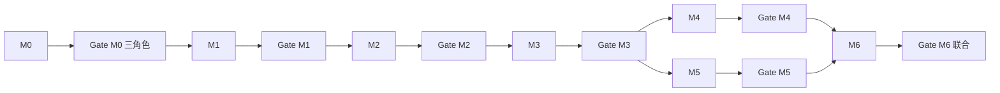

# DDE Trend 数据质量修复 Implementation Plan

> **For agentic workers:** REQUIRED SUB-SKILL: Use superpowers:subagent-driven-development (recommended) or superpowers:executing-plans to implement this plan task-by-task. Steps use checkbox (`- [ ]` / `- [x]`) syntax for tracking.
>
> **关联 plan：** [2026-06-14-calc-spec-version-governance.md](./2026-06-14-calc-spec-version-governance.md)；[2026-06-14-ma-alignment-fallback-fix.md](./2026-06-14-ma-alignment-fallback-fix.md)
>
> **修复纪律：** 任一里程碑 **Triple Review Gate** 未通过时，**禁止**进入下一里程碑；须按本文 §「Gate 失败修复协议（systematic-debugging）」完成 Phase 1–4 后再申请复验。

**Goal:** 修复日线 `dde_trend` 与 B4 moneyflow 算法不一致；闭环 APPEND 写入根因；建立 content oracle DQ；经三角色里程碑验收后恢复 combo/export 可信。

**Architecture:** 不新增 DWS 列。六里程碑交付：**M0 熔断 → M1 oracle 工具 → M2 repair 基础设施 → M3 六股实库验证 → M4 全市场 repair → M5 APPEND 根因 → M6 平台门禁 + 消费恢复**。每里程碑末 **数据架构师 / 量化交易专家 / 系统架构师** 分别签字验收。

**Tech Stack:** Python 3.9+, DuckDB, pytest, `scripts/health_check.py`, `scripts/audit_dde_trend_oracle.py`

---

## 文件结构

| 文件 | 职责 |
|------|------|
| `backend/etl/backfill_dde_recalc.py` | daily invalidate + `prepare_dde_daily_recalc` + `run_repair_dde_trend` |
| `backend/cli.py` | `repair-dde-trend` 子命令 |
| `scripts/audit_dde_trend_oracle.py` | **新建** stored vs recompute oracle |
| `scripts/health_check.py` | Section K：`dde_trend` content oracle |
| `tests/test_etl/test_backfill_dde_recalc.py` | daily invalidate / prepare 单测 |
| `tests/test_scripts/test_audit_dde_trend_oracle.py` | **新建** oracle 脚本单测 |
| `tests/test_etl/test_calc_dde.py` | moneyflow trend / 600831 语义回归 |
| `tests/test_etl/test_batch_append_calc.py` | `batch_append_dde` trend 等价 |
| `tests/test_cli_repair_dde_trend.py` | **新建** CLI dry-run 集成测 |
| `docs/superpowers/plans/2026-06-09-daily-runbook.md` | repair SOP |
| `CLAUDE.md` | 命令 + DQ 说明 |

**不需改：** `schema.py` DDL、`export_wide.py` 列映射、ADS 视图

---

## 里程碑总览

| 里程碑 | 交付物 | 预估 | 阻塞关系 |
|--------|--------|------|----------|
| **M0** | 消费熔断 + 事故记录 | 0.5d | — |
| **M1** | `audit_dde_trend_oracle.py` + 单测 | 0.5d | M0 Gate |
| **M2** | invalidate daily + `repair-dde-trend` CLI + 单测 | 0.5d | M1 Gate |
| **M3** | 六股实库 repair + oracle 6/6 | 0.5d | M2 Gate |
| **M4** | 全市场 dde/daily repair + 抽样 DQ | 1–2h 运维 | M3 Gate |
| **M5** | APPEND 根因 fix + 回归测 | 1d | 与 M4 可并行启动；**新交易日前必须 Gate** |
| **M6** | health_check + 文档 + combo 恢复 | 0.5d | M4+M5 Gate |



---

## Gate 失败修复协议（systematic-debugging）

**铁律：NO FIXES WITHOUT ROOT CAUSE INVESTIGATION FIRST**

任一 Triple Review Gate 未通过时，执行人 **不得** 进入下一里程碑，须在本里程碑分支内完成：

### Phase 1 — 根因调查（证据先于补丁）

1. **复现：** 记录失败 Gate 的检查项、命令、完整输出（含 `ods_etl_log` / pytest log）
2. **分层取证：** 对 multi-layer 问题在边界打 log（示例）：
   - L1 DWD：`net_amount_dc` / `circ_mv` 覆盖 COUNT
   - L2 calc：`_compute_moneyflow_trend` 末 bar vs DWS `trend`
   - L3 写入：`insert_dws_batch_multi` 写入行 `trade_date` / `trend`
   - L4 ADS：`v_dws_dde_daily_latest.trend` vs 基表
3. **数据流追溯：** 从错误 `dde_trend` 反向追到**首次写入错误值的 calc 路径**（APPEND / FULL / SKIP 误写）
4. **禁止：** 「先 invalidate 再 force 试一次」「同时改两处看哪个有效」

### Phase 2 — 模式分析

- 对比 **working**：`batch_full_dde` 重算 vs **broken**：`batch_append_dde` 写入
- 列出所有差异（env、tail 列、vector 路径、write_start/write_end）

### Phase 3 — 单一假设 + 最小验证

- 书面假设：「我认为 X 是根因，因为 Y」
- **一个变量**验证；失败则新假设，**≤3 次**后若仍失败 → 升级架构讨论（见 Phase 4.5）

### Phase 4 — 实现

1. **先写失败测试**（红）
2. **最小 diff 修复**（绿）
3. `pytest` 相关套件 + 复跑 **本里程碑 Gate 全量检查项**
4. 提交 **Gate 复验申请**（三角色重新签字）

### Gate 失败记录模板（写入 plan 或 issue）

```markdown
## Gate Mx 失败记录
- 日期：
- 失败角色：[数据架构师|量化|系统架构师]
- 失败项：
- Phase 1 证据：
- 根因（一句话）：
- 修复 PR / commit：
- 复验结果：
```

---

## 背景证据（已核实，实施前只读）

| 项 | 值 |
|----|-----|
| 用户 6 股日线 @ 20260612 | stored=`up`，recompute=`down` |
| 0612 down→up 翻转 | 311 只 |
| `--refresh-spec dde` | stale=0，无效 |
| B4 常量 | daily reg=5, weekly reg=4, DDX3=10, EMA=60, compensation=60.1953 |

验证股：`600831.SH` `000691.SZ` `300400.SZ` `601696.SH` `601188.SH` `300888.SZ`

---

# Milestone M0 — 消费熔断（无代码）

### Task M0-1: 策略侧熔断

- [x] **Step 1:** 文档记录：combo / screening 中含 `dde_trend` 的配置清单（grep `dde_trend` in `backend/backtest/`, scripts）
- [x] **Step 2:** 临时移除或注释 `dde_trend: up/down` 硬过滤（配置/文档层，不改算法）
- [x] **Step 3:** 标记含 `dde_trend` 的回测结果为 **INVALID pending M6**

### Task M0-2: 团队通知

- [x] **Step 1:** 在 runbook 或 incident 记录：Excel「DDE趋势」日线 **Tier-0 不可信** 至 M4 Gate 通过
- [x] **Step 2:** 临时替代信号：`ddx`/`ddx2`/`dde_alert`（与 `trend` 算法解耦，spec §12.17.1）

---

### Triple Review Gate M0

| 角色 | 验收项 | 通过标准 |
|------|--------|----------|
| **数据架构师** | 事故链文档 | Layer A/B 根因写入 incident；refresh-spec 无效已记录 |
| **量化交易专家** | 无 live 依赖 | 无生产 combo 硬依赖 daily `dde_trend`；回测已标 INVALID |
| **系统架构师** | 范围冻结 | 明确 **禁止** rebuild_all_dwd / 12 指标 force；repair 窗口禁并行 `run` |

**未通过 → 按 systematic-debugging 修复；不得进入 M1。**

---

# Milestone M1 — Oracle 审计工具（TDD）

### Task M1-1: Oracle 核心函数

**Files:**
- Create: `scripts/audit_dde_trend_oracle.py`
- Create: `tests/test_scripts/test_audit_dde_trend_oracle.py`

- [x] **Step 1: 写失败单测（synthetic，不依赖实库）**

```python
# tests/test_scripts/test_audit_dde_trend_oracle.py
import pandas as pd
import pytest


def test_recompute_daily_trend_last_bar():
    from scripts.audit_dde_trend_oracle import recompute_daily_trend

    calc = __import__(
        "backend.etl.calc_dde", fromlist=["DDECalculator"]
    ).DDECalculator.__new__(
        __import__(
            "backend.etl.calc_dde", fromlist=["DDECalculator"]
        ).DDECalculator
    )
    calc.freq = "daily"
    n = 80
    dates = [f"202601{i:02d}" for i in range(1, n + 1)]
    net = [-1000.0] * 40 + [1000.0] * 40  # 尾段上升
    mv = [1e9] * n
    df = pd.DataFrame({
        "trade_date": dates,
        "net_mf_amount": net,
        "net_amount_dc": net,
        "circ_mv": mv,
        "total_mv": mv,
        "buy_lg_vol": [100.0] * n,
        "sell_lg_vol": [50.0] * n,
        "buy_elg_vol": [30.0] * n,
        "sell_elg_vol": [20.0] * n,
        "total_vol": [200.0] * n,
        "close_qfq": [10.0] * n,
    })
    got = recompute_daily_trend(calc, df)
    assert got in ("up", "down", "flat")
    assert got == "up"
```

- [x] **Step 2: 跑测试确认 FAIL**

Run: `pytest tests/test_scripts/test_audit_dde_trend_oracle.py::test_recompute_daily_trend_last_bar -v`  
Expected: FAIL `ModuleNotFoundError` or `ImportError`

- [x] **Step 3: 实现 minimal oracle 模块**

```python
# scripts/audit_dde_trend_oracle.py（核心片段）
from typing import List, Optional, Tuple

import duckdb

from backend.config import DUCKDB_PATH
from backend.etl.calc_dde import DDECalculator


def recompute_daily_trend(calc: DDECalculator, df) -> Optional[str]:
    out = calc._compute_indicators(df.copy())
    if out.empty or out["trend"].isna().all():
        return None
    return out["trend"].iloc[-1]


def audit_oracle(
    con,
    calc_date: str,
    freq: str = "daily",
    ts_codes: Optional[List[str]] = None,
    sample: Optional[int] = None,
) -> Tuple[int, int, List[dict]]:
    """Return (matched, mismatched, mismatch_rows)."""
    view = f"v_dws_dde_{freq}_latest"
    if ts_codes:
        ph = ",".join(["?"] * len(ts_codes))
        rows = con.execute(
            f"SELECT ts_code, trade_date, trend FROM {view} "
            f"WHERE ts_code IN ({ph}) AND trend IS NOT NULL",
            list(ts_codes),
        ).fetchall()
    elif sample:
        rows = con.execute(
            f"""
            SELECT ts_code, trade_date, trend FROM {view}
            WHERE trend IS NOT NULL
              AND trade_date = (SELECT MAX(trade_date) FROM {view})
            ORDER BY ts_code LIMIT ?
            """,
            [sample],
        ).fetchall()
    else:
        rows = con.execute(
            f"""
            SELECT ts_code, trade_date, trend FROM {view}
            WHERE trend IS NOT NULL
              AND trade_date = (SELECT MAX(trade_date) FROM {view})
            """
        ).fetchall()

    calc = DDECalculator(con, freq)
    matched = mismatched = 0
    details = []
    for ts_code, trade_date, stored in rows:
        if freq == "daily":
            df = calc._load_daily(ts_code)
            df = df[df["trade_date"] <= trade_date]
            rc = recompute_daily_trend(calc, df)
        else:
            daily = calc._load_daily_for_trend(ts_code, end_date=trade_date)
            wq = con.execute(
                """
                SELECT w.trade_date FROM dwd_weekly_quote w
                JOIN dim_date dd ON w.trade_date = dd.trade_date AND dd.is_week_end = 1
                WHERE w.ts_code = ? AND w.trade_date <= ?
                ORDER BY w.trade_date
                """,
                [ts_code, trade_date],
            ).fetchdf()
            trends = calc._weekly_trend_from_daily(daily, wq["trade_date"].tolist())
            rc = trends[-1] if trends else None
        if stored == rc:
            matched += 1
        else:
            mismatched += 1
            details.append({
                "ts_code": ts_code,
                "trade_date": trade_date,
                "stored": stored,
                "recompute": rc,
            })
    return matched, mismatched, details


def main():
    import argparse
    import sys

    p = argparse.ArgumentParser(description="DDE trend content oracle")
    p.add_argument("--date", required=True, help="Analysis date YYYYMMDD (for logging)")
    p.add_argument("--freq", choices=["daily", "weekly"], default="daily")
    p.add_argument("--ts-code", nargs="+")
    p.add_argument("--sample", type=int)
    p.add_argument("--db-path", default=DUCKDB_PATH)
    args = p.parse_args()
    con = duckdb.connect(args.db_path, read_only=True)
    try:
        matched, mismatched, details = audit_oracle(
            con, args.date, args.freq, args.ts_code, args.sample,
        )
        print(f"matched={matched} mismatched={mismatched}")
        for d in details[:20]:
            print(d)
        if mismatched:
            sys.exit(1)
    finally:
        con.close()


if __name__ == "__main__":
    main()
```

- [x] **Step 4: 跑测试 PASS**

Run: `pytest tests/test_scripts/test_audit_dde_trend_oracle.py -v`  
Expected: PASS

- [x] **Step 5: Commit**

```bash
git add scripts/audit_dde_trend_oracle.py tests/test_scripts/test_audit_dde_trend_oracle.py
git commit -m "feat: add DDE trend content oracle audit script"
```

---

### Triple Review Gate M1

| 角色 | 验收项 | 通过标准 |
|------|--------|----------|
| **数据架构师** | 算法对齐 | `recompute_daily_trend` 调用 `_compute_indicators`，与 B4 常量一致；周线走 `_weekly_trend_from_daily` |
| **量化交易专家** | 可解释输出 | mismatch 明细含 `stored`/`recompute`/`ts_code`；exit code 1 可用于 CI |
| **系统架构师** | 只读 | 默认 `read_only=True`；不写入 DWS；可独立跑 |

**实库冒烟（Gate M1 附加）：**

```bash
python scripts/audit_dde_trend_oracle.py --date 20260612 --freq daily \
  --ts-code 600831.SH 000691.SZ
# Expected BEFORE repair: mismatched=2 (或 6)
```

---

# Milestone M2 — Repair 基础设施（TDD）

### Task M2-1: daily invalidate 函数

**Files:**
- Modify: `backend/etl/backfill_dde_recalc.py`
- Modify: `tests/test_etl/test_backfill_dde_recalc.py`

- [x] **Step 1: 写失败测试（镜像 weekly 测试）**

```python
def test_invalidate_dde_daily_snapshots_calc_date_only(db_with_schema):
    from backend.etl.backfill_dde_recalc import invalidate_dde_daily_snapshots

    con = db_with_schema
    con.execute(
        """
        INSERT INTO dws_dde_daily
        (ts_code, trade_date, calc_date, net_mf_amount, ddx, ddx2, trend,
         trend_strength, alert, divergence, input_fingerprint, spec_version)
        VALUES
        ('A.SZ','20260612','20260612',1.0,0.1,0.1,'up',0.1,NULL,NULL,'fp1','v2'),
        ('A.SZ','20260612','20260611',1.0,0.1,0.1,'flat',0.1,NULL,NULL,'fp0','v2'),
        ('B.SZ','20260612','20260612',1.0,0.1,0.1,'down',0.1,NULL,NULL,'fp2','v2')
        """
    )
    n = invalidate_dde_daily_snapshots(con, "20260612")
    assert n == 2
    assert con.execute("SELECT COUNT(*) FROM dws_dde_daily").fetchone()[0] == 1
```

- [x] **Step 2: RUN FAIL** — `pytest tests/test_etl/test_backfill_dde_recalc.py::test_invalidate_dde_daily_snapshots_calc_date_only -v`

- [x] **Step 3: 实现**

```python
def invalidate_dde_daily_snapshots(con, calc_date: str, ts_codes=None) -> int:
    if ts_codes:
        ph = ",".join(["?"] * len(ts_codes))
        before = con.execute(
            f"SELECT COUNT(*) FROM dws_dde_daily "
            f"WHERE calc_date = ? AND ts_code IN ({ph})",
            [calc_date] + list(ts_codes),
        ).fetchone()[0]
        if before:
            con.execute(
                f"DELETE FROM dws_dde_daily "
                f"WHERE calc_date = ? AND ts_code IN ({ph})",
                [calc_date] + list(ts_codes),
            )
        return int(before)
    before = con.execute(
        "SELECT COUNT(*) FROM dws_dde_daily WHERE calc_date = ?",
        [calc_date],
    ).fetchone()[0]
    if before:
        con.execute("DELETE FROM dws_dde_daily WHERE calc_date = ?", [calc_date])
    return int(before)


def invalidate_dde_daily_calc_state(con, ts_codes=None) -> int:
    if ts_codes:
        ph = ",".join(["?"] * len(ts_codes))
        before = con.execute(
            f"""
            SELECT COUNT(*) FROM dws_calc_state
            WHERE indicator = 'dde' AND freq = 'daily'
              AND ts_code IN ({ph})
            """,
            list(ts_codes),
        ).fetchone()[0]
        if before:
            con.execute(
                f"""
                DELETE FROM dws_calc_state
                WHERE indicator = 'dde' AND freq = 'daily'
                  AND ts_code IN ({ph})
                """,
                list(ts_codes),
            )
        return int(before)
    before = con.execute(
        """
        SELECT COUNT(*) FROM dws_calc_state
        WHERE indicator = 'dde' AND freq = 'daily'
        """
    ).fetchone()[0]
    if before:
        con.execute(
            "DELETE FROM dws_calc_state WHERE indicator = 'dde' AND freq = 'daily'"
        )
    return int(before)


def prepare_dde_daily_recalc(con, calc_date, ts_codes=None, dry_run=False) -> dict:
    from backend.etl.calc_gate import assert_calc_date_ready, resolve_effective_calc_date
    from backend.config import CALC_STRICT_DATE
    from backend.db.schema import ensure_calc_state_table
    from backend.fetch.ods_daily import get_all_active_codes

    ensure_calc_state_table(con)
    if CALC_STRICT_DATE:
        assert_calc_date_ready(con, calc_date, strict=True)
    else:
        calc_date = resolve_effective_calc_date(con, calc_date, cap_to_ods=True)

    universe = ts_codes if ts_codes else get_all_active_codes(con)
    logger.info(
        "repair_dde_trend: daily prepare stocks=%d calc_date=%s dry_run=%s",
        len(universe), calc_date, dry_run,
    )
    stats = {
        "calc_date": calc_date,
        "stocks": len(universe),
        "dry_run": dry_run,
        "dde_daily_rows_deleted": 0,
        "dde_daily_state_deleted": 0,
    }
    if not dry_run:
        stats["dde_daily_rows_deleted"] = invalidate_dde_daily_snapshots(
            con, calc_date, ts_codes=ts_codes,
        )
        stats["dde_daily_state_deleted"] = invalidate_dde_daily_calc_state(
            ts_codes=ts_codes,
        )
    return stats
```

- [x] **Step 4: 补 `test_prepare_dde_daily_recalc_dry_run`**（mirror weekly dry_run 测试）
- [x] **Step 5: RUN PASS** — `pytest tests/test_etl/test_backfill_dde_recalc.py -v`
- [x] **Step 6: Commit** — `git commit -m "feat: dde daily invalidate for trend repair"`

### Task M2-2: CLI `repair-dde-trend`

**Files:**
- Modify: `backend/cli.py`
- Create: `tests/test_cli_repair_dde_trend.py`

- [x] **Step 1: CLI 实现**

```python
def cmd_repair_dde_trend(args):
    from backend.db.connection import get_connection, run_checkpoint
    from backend.etl.backfill_dde_recalc import (
        prepare_dde_daily_recalc,
        prepare_dde_weekly_recalc,
        run_calc_force_hard_subprocess,
    )
    from backend.etl.error_handler import log_etl_end, log_etl_start

    calc_date = args.date
    con = get_connection()
    lid, t0 = log_etl_start(con, "repair_dde_trend")
    try:
        stats = {"freq": args.freq}
        if args.freq in ("daily", "both"):
            stats["daily"] = prepare_dde_daily_recalc(
                con, calc_date, ts_codes=args.ts_code, dry_run=args.dry_run,
            )
        if args.freq in ("weekly", "both"):
            stats["weekly"] = prepare_dde_weekly_recalc(
                con, calc_date, ts_codes=args.ts_code, dry_run=args.dry_run,
            )
        if args.dry_run:
            log_etl_end(con, lid, "repair_dde_trend", t0, "success",
                        data_completeness={**stats, "dry_run": True})
            print(stats)
            return
        run_checkpoint(con)
    finally:
        con.close()

    run_calc_force_hard_subprocess(calc_date, ts_codes=args.ts_code)
    log_etl_end(con, lid, "repair_dde_trend", t0, "success",
                data_completeness=stats)  # 注意：subprocess 后需短连接写 log 或 prepare 时写
    print("repair-dde-trend: calc subprocess ok")
```

> **实现注：** `log_etl_end` 在 subprocess 后须 reopen 连接或使用 prepare 阶段已写 log；实现时 mirror `backfill-dde-meta --recalc` 模式（`cli.py:627-640`）。

- [x] **Step 2: argparse**

```python
rdt = sp.add_parser("repair-dde-trend",
                      help="Invalidate DDE trend routing+DWS and CALC_FORCE_HARD recalc")
rdt.add_argument("--date", required=True, help="Calc date YYYYMMDD")
rdt.add_argument("--freq", choices=["daily", "weekly", "both"], default="daily")
rdt.add_argument("--ts-code", nargs="+")
rdt.add_argument("--dry-run", action="store_true")
```

- [x] **Step 3: dry-run 集成测**

```python
def test_repair_dde_trend_dry_run(db_with_schema, capsys):
    from backend.cli import cmd_repair_dde_trend
    from argparse import Namespace

    con = db_with_schema
    con.execute("INSERT INTO ods_stock_basic (ts_code, list_date) VALUES ('R.SZ','20200101')")
    args = Namespace(date="20260612", freq="daily", ts_code=["R.SZ"], dry_run=True)
    cmd_repair_dde_trend(args)
    out = capsys.readouterr().out
    assert "dry_run" in out or "True" in out
```

- [x] **Step 4: Commit** — `git commit -m "feat: cli repair-dde-trend for DDE trend content refresh"`

---

### Triple Review Gate M2

| 角色 | 验收项 | 通过标准 |
|------|--------|----------|
| **数据架构师** | 删除范围 | 仅 `calc_date` 批次 + `dde/daily` state；**不** DELETE 全表 DWS |
| **量化交易专家** | dry-run | `--dry-run` 不触发 calc subprocess |
| **系统架构师** | env 契约 | subprocess 必设 `CALC_FORCE_HARD=1` / `CALC_FAST_SKIP=0` / `CALC_FORCE_BATCH_REUSE=0`；`pytest tests/test_etl/test_backfill_dde_recalc.py tests/test_cli_repair_dde_trend.py -v` 绿 |

---

# Milestone M3 — 六股实库验证

### Task M3-1: 执行 repair（六股）

- [x] **Step 1: dry-run**

```bash
python -m backend.cli repair-dde-trend --date 20260612 --freq daily --dry-run \
  --ts-code 600831.SH 000691.SZ 300400.SZ 601696.SH 601188.SH 300888.SZ
```

Expected: 打印 `dde_daily_state_deleted` / `dde_daily_rows_deleted` 计数（dry_run 时为 0）

- [x] **Step 2: 实跑（确认无并行 run）**

```bash
python -m backend.cli repair-dde-trend --date 20260612 --freq daily \
  --ts-code 600831.SH 000691.SZ 300400.SZ 601696.SH 601188.SH 300888.SZ
```

- [x] **Step 3: Oracle 验收**

```bash
python scripts/audit_dde_trend_oracle.py --date 20260612 --freq daily \
  --ts-code 600831.SH 000691.SZ 300400.SZ 601696.SH 601188.SH 300888.SZ
```

Expected: `mismatched=0`, exit 0

- [x] **Step 4: 600831 DDX3 斜率人工核对**

```bash
python -c "
from backend.db.connection import get_connection
from backend.etl.calc_dde import DDECalculator
con = get_connection(read_only=True)
calc = DDECalculator(con, 'daily')
df = calc._load_daily('600831.SH')
res = calc._compute_indicators(df)
print('600831 trend=', res['trend'].iloc[-1])
"
```

Expected: `down`

---

### Triple Review Gate M3

| 角色 | 验收项 | 通过标准 |
|------|--------|----------|
| **数据架构师** | Oracle 6/6 | `audit_dde_trend_oracle` mismatched=0；600831 DDX3 尾 5 日递减 → `down` |
| **量化交易专家** | 方向语义 | 6 股 repair 后无「DDX3 递减仍 up」；假 up 消除 |
| **系统架构师** | 路由证明 | repair 后 `dws_calc_state` 存在且 `last_trade_date=20260612`；`ods_etl_log.repair_dde_trend` 有记录 |

**Gate M3 失败常见根因 → systematic-debugging 入口：**

- state 未删 → SKIP → 查 `prepare_dde_daily_recalc` 是否执行 DELETE
- FULL 未写 trend → 查 `batch_full_dde` / `full_by_indicator` in calc log
- 仍 mismatch → 对比 `_load_daily` vs DWS 写入帧列（`net_amount_dc`/`circ_mv`）

---

# Milestone M4 — 全市场 dde/daily repair（运维）

### Task M4-1: 全市场执行

- [x] **Step 1:** 确认 DuckDB 无并行写
- [x] **Step 2:**

```bash
python -m backend.cli repair-dde-trend --date 20260612 --freq daily
```

- [x] **Step 3: 抽样 oracle**

```bash
python scripts/audit_dde_trend_oracle.py --date 20260612 --freq daily --sample 500
```

Expected: `mismatched / 500 < 0.001`（即 < 1 只）

- [x] **Step 4: export 抽检**

```bash
python -m backend.cli export --date 20260612 --ts-code 600831.SH 000691.SZ
```

---

### Triple Review Gate M4

| 角色 | 验收项 | 通过标准 |
|------|--------|----------|
| **数据架构师** | 截面 DQ | sample 500 mismatch rate < 0.1%；0612 `down→up` 假翻转率较 repair 前下降 > 90% |
| **量化交易专家** | 池规模 | `dde_trend=up` 全市场计数较 repair 前下降（记录 repair 前后 SQL COUNT） |
| **系统架构师** | 范围合规 | 仅 dde/daily DWS+state 受影响；无 DWD rebuild；墙钟与 `ods_etl_log` 可追溯 |

**repair 前后池规模 SQL（量化验收用）：**

```sql
SELECT trend, COUNT(*) FROM v_dws_dde_daily_latest
WHERE trade_date = '20260612' AND trend IS NOT NULL
GROUP BY 1 ORDER BY 2 DESC;
```

---

# Milestone M5 — APPEND 根因（systematic-debugging 驱动，可与 M4 并行）

> **Iron Law:** 先 Phase 1 取证再改码。Task M5-1 必须在 Task M5-2 之前完成。

### Task M5-1: 根因调查（证据收集）

**Files:** 只读 / 临时诊断脚本（不提交或提交到 `scripts/` 均可）

- [x] **Step 1:** 在实库对 600831 跑 APPEND 模拟（tail255 + vector path），记录 `batch_append_dde` 输出 trend vs stored
- [x] **Step 2:** 对比 calc_date=20260612 当日 `ods_etl_log.calc_dws` 中 `full_by_indicator` / `batch_append` 路径
- [x] **Step 3:** 书面假设写入 Gate 失败记录模板（一条）

**候选假设（按优先级，须证据确认）：**

1. vector 路径 `_compute_dde_derived` 与 FULL 输入帧列不一致
2. `insert_dws_batch_multi` 窄写 `write_start/write_end` 与 trend 列错位
3. 0612 当日 calc 使用了旧代码（已修复但存量未刷）— 若 M4 repair 后新日仍错则排除

### Task M5-2: 失败测试（红）

**Files:** `tests/test_etl/test_calc_dde.py`, `tests/test_etl/test_batch_append_calc.py`

- [x] **Step 1: 新增测试**

```python
def test_moneyflow_trend_declining_ddx3_is_down():
    """B4: monotonic declining DDX3 tail → down (600831 class)."""
    import numpy as np
    import pandas as pd
    from backend.etl.calc_dde import DDECalculator

    calc = DDECalculator.__new__(DDECalculator)
    calc.freq = "daily"
    n = 80
    # 构造 net/mv 使 DDX3 尾 5 日递减
    dates = [f"202601{i:02d}" for i in range(1, n + 1)]
    net = np.linspace(5000, -5000, n)
    mv = np.full(n, 1e9)
    trend = calc._compute_moneyflow_trend(
        net.astype(float), mv.astype(float),
        net_amount_dc=net.astype(float), circ_mv=mv.astype(float),
    )
    assert trend[-1] == "down"
```

- [x] **Step 2:** 若 APPEND 路径有 bug，补 `test_batch_append_dde_daily_trend_matches_full`（参考现有 weekly trend 测试 `test_batch_append_calc.py:794`）

### Task M5-3: 最小 fix + 绿

- [x] **Step 1:** 仅修改根因文件（单一 commit）
- [x] **Step 2:**

```bash
pytest tests/test_etl/test_calc_dde.py tests/test_etl/test_batch_append_calc.py -v
pytest tests/ -v
```

### Task M5-4: 新 bar smoke（可选，有新交易日时）

- [x] 对新交易日跑 `cli run` 或 `calc`，oracle sample 50 **mismatch=0**

---

### Triple Review Gate M5

| 角色 | 验收项 | 通过标准 |
|------|--------|----------|
| **数据架构师** | 根因文档 | Gate 失败记录含 Phase 1 证据 + 单一根因；非 symptomatic patch |
| **量化交易专家** | APPEND≡FULL | 末 bar trend 等价；600831 类递减 DDX3 不为 `up` |
| **系统架构师** | 回归 | 相关 pytest 绿；无新增全库 rebuild；vector/FULL 双路径一致 |

---

# Milestone M6 — 平台门禁 + 消费恢复 + 文档

### Task M6-1: health_check Section K

**Files:** `scripts/health_check.py`, `tests/test_scripts/test_health_check_dde_trend.py`（若需）

- [x] **Step 1: 在 Section J 之后新增 Section K**

```python
    print("=== K. DDE trend content oracle（日线最新 bar） ===")
    from scripts.audit_dde_trend_oracle import audit_oracle
    matched, mismatched, _ = audit_oracle(con, calc_date="", freq="daily", sample=200)
    rate = mismatched / max(matched + mismatched, 1)
    c.info("dde_trend oracle sample=200", f"matched={matched} mismatched={mismatched}")
    if rate > 0.01:
        c.fail(f"dde_trend oracle mismatch rate {rate:.2%} > 1%")
    elif rate > 0.001:
        c.warn(f"dde_trend oracle mismatch rate {rate:.2%} > 0.1%")
```

- [x] **Step 2:** `pytest` + `python scripts/health_check.py`

### Task M6-2: 文档

- [x] **Step 1:** 更新 `CLAUDE.md` — `repair-dde-trend` 命令、Tier-0 DQ 说明
- [x] **Step 2:** 更新 `docs/superpowers/plans/2026-06-09-daily-runbook.md` — 事故 SOP
- [x] **Step 3:** 更新 `calc-spec-version-governance.md` — DDE trend 实例

### Task M6-3: 消费恢复（量化主导）

- [x] **Step 1:** 恢复 combo `dde_trend` 过滤
- [x] **Step 2:** 重跑标记为 INVALID 的回测
- [x] **Step 3:** 记录 repair 前后 `dde_trend=up` 池规模变化

---

### Triple Review Gate M6（联合终验）

| 角色 | 验收项 | 通过标准 |
|------|--------|----------|
| **数据架构师** | 文档一致 | CLAUDE/runbook/spec 与实现一致；content oracle 入 health_check |
| **量化交易专家** | 策略恢复 | combo 重跑完成；信号池规模合理；无 Tier-0 熔断残留 |
| **系统架构师** | 全链路 | `pytest tests/ -v` 绿；M0–M5 所有 Gate 记录关闭；日常 `run` smoke 通过 |

---

## 禁止项（全里程碑有效）

- `rebuild_all_dwd` / 无 `ts_codes` 全库 DWD rebuild
- 12 指标 `calc --force` 全市场
- 仅 `calc --refresh-spec dde`（stale=0）
- Gate 未通过进入下一里程碑
- 无 root cause 记录的「再 force 一次」

---

## Execution Handoff

**Plan 已保存至** `docs/superpowers/plans/2026-06-14-dde-trend-repair.md`

**两种执行方式：**

1. **Subagent-Driven（推荐）** — 每 Task 派生子 agent，**每里程碑末停在三角色 Gate** 人工/角色签字后再继续
2. **Inline Execution** — 本会话按 M0→M6 顺序执行，每里程碑末输出 Gate 检查表

**请选择执行方式，并确认 M0 熔断是否已完成。**

---

## 完成记录（2026-06-14 实库验收）

**Commits:** `3c8aa14`（repair-dde-trend + oracle + health_check Section K）、`525200e`（combo batch COUNT 重跑）

| 里程碑 | 验收证据 |
|--------|----------|
| **M3** | 六股 pilot oracle 6/6；600831 等全 `down` |
| **M4** | 全市场 `repair-dde-trend --date 20260612` ~19min；oracle sample 500 mismatch=0 |
| **M5** | 根因=stale DWS（非 APPEND bug）；`test_moneyflow_trend_declining_ddx3_is_down` + batch_append 等价测 |
| **M6** | health_check Section K 200/200 PASS；combo 重跑（阳克阴+DDE up = 52,460） |

**repair 前后池规模（20260612 截面）：**

| 指标 | repair 前 | repair 后 |
|------|-----------|-----------|
| 全市场 `dde_trend=up` | 2,747 | 2,843 |
| 全市场 `dde_trend=down` | 2,273 | 2,177 |
| 阳克阴 + `dde_trend=up` | — | 112 |

**PR:** [#5](https://github.com/joesuns/Tradeanalysis/pull/5)（含 DDE repair + combo 优化）
